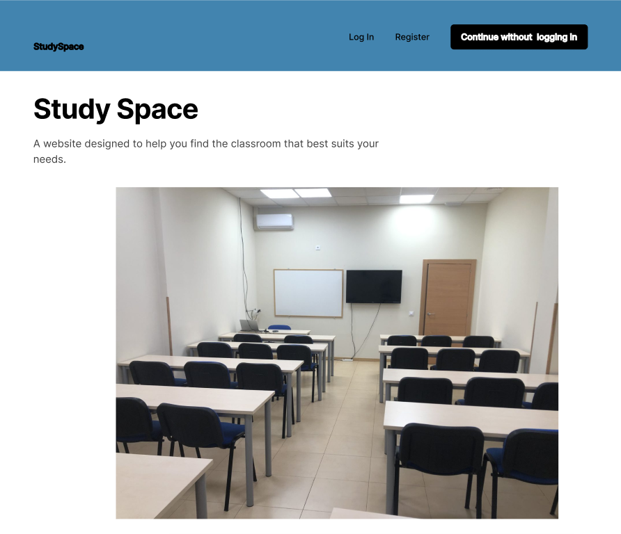
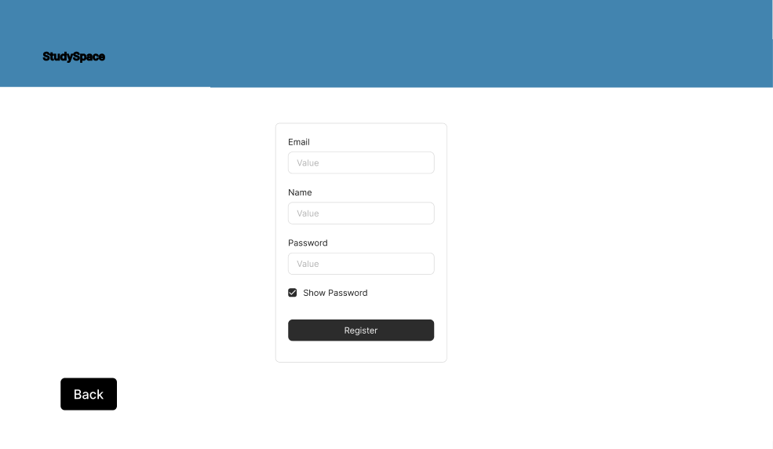
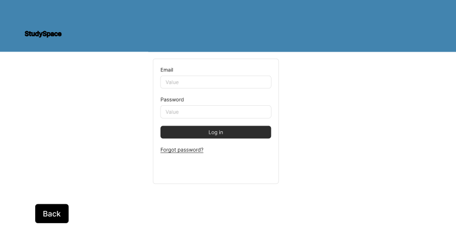

# 2025-StudySpace

---

## 📜 Introducción

---

## 📌 Fase 1
### Prototipos de pantallas
Prototipos de las pantallas finales de la aplicación web y una breve descripcion debajo de cada una, explicando su funcionalidad y sentido:

* **Pantalla de incio**
  
* **Pantalla de registrarse**
  
* **Pantalla de inciar sesion**
  
* **Pantalla vision disponibilidad aulas**
  

### Diagrama de Navegación

### Funcionalidades diferentes tipos de usuarios

### Diagrama de Entidades

.png)

---

## 📌 Fase 2

