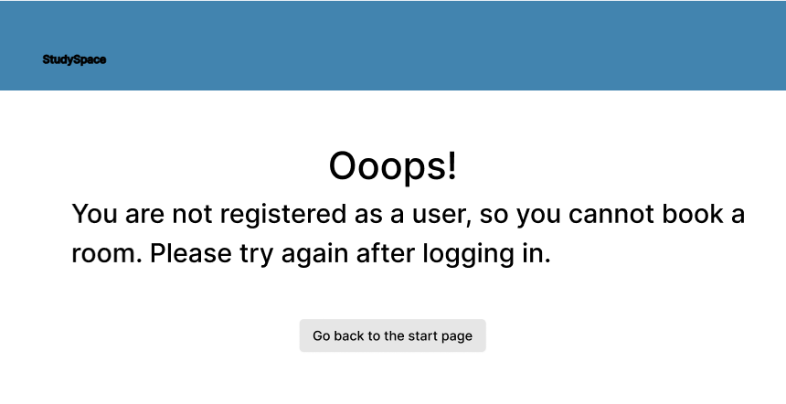
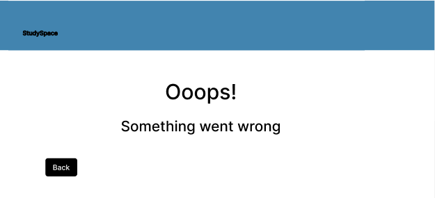
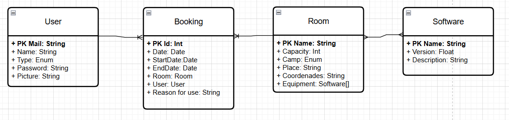

# 2025-StudySpace

---

## 📜 Introducción
StudySpace es una aplicación web diseñada para gestionar de manera eficiente la reserva de aulas de informática en un entorno universitario. El objetivo principal de esta aplicación web es ofrecer a los estudiantes, profesores y administradores una plataforma intuitiva que permita consultar la disponibilidad de los espacios, visualizar sus características y realizar reservas de forma sencilla.

---

## 📌 Fase 1
### Prototipos de pantallas
Prototipos de las pantallas finales de la aplicación web y una breve descripcion debajo de cada una, explicando su funcionalidad y sentido:

* **Pantalla de incio**
  
* **Pantalla de registrarse**
  
* **Pantalla de inciar sesion**
  
* **Pantalla seleccionar campus**
  
* **Pantalla seleccionar dia y hora para la reserva**
  
* **Pantalla seleccionar aula dentro de ese campus y esa fecha**

Aquí seran capaces de comprobar la información y detalles del aula proporcionados para los diferentes tipos de usuarios.
  
* **Pantalla seleccionar opciones del administrador**
  
* **Pantalla seleccionar opciones de aulas para el administrador**
  
* **Pantalla crear nuevas aulas en el servicio**
  
* **Pantalla selecionar el aula a editar o borrarla**
  
* **Pantalla editar aulas existentes**

Con un campo especial para activar o desactivar la disponibilidad del aula si la situación (obras, reformas, ...) lo requiere.
  
* **Pantalla seleccionar usuario para el administrador**
  
* **Pantalla administrar al usuario correspondiente como administrador**
  
* **Pantalla para editar el perfil de usuario**
  

* **Pantalla de exito al reservar un aula correctamente**

  

* **Pantalla para recordar registrarse al usuario anónimo**
  
* **Pantalla de error**
  

### Diagramas de Navegación
* **Diagrama de navegación para reservar un aula y ver su disponibilidad.**

.png)

* **Diagrama de navegación de la acciones posibles siendo un administrador.**

.png)

### 🎯 Objetivos
La aplicación sera capaz de realizar y cumplir los siguientes objetivos:

🔹 **Objetivos funcionales**

* Permitir a usuarios no registrados visualizar la disponibilidad de aulas.

* Ofrecer a usuarios registrados la posibilidad de reservar, modificar y cancelar sus reservas.

* Posibilitar a los administradores la gestión completa de aulas y usuarios.

* Incluir un sistema de búsqueda y filtrado avanzado de aulas.

🔹 **Objetivos técnicos**

* Implementación del backend con Java + Spring Boot.

* Base de datos relacional MySQL para la gestión de reservas, software, usuarios y aulas.

* Interfaz web desarrollada con Angular.

* Control de versiones,CI/CD y ramas mediante GitHub.

* Integración de diagramas en el proceso de diseño.

### 🛠️ Metodología
El desarrollo seguirá un enfoque iterativo y secuencial, con entregas periódicas y revisión por el tutor en cada fase.

* **Fase 1:** Definición de funcionalidades y pantallas (Finalización: 15 septiembre)

* **Fase 2:** Configuración repositorio, CI y Sonar (Finalización: 1 octubre)

* **Fase 3:** Funcionalidad básica con pruebas: Unit, Int y E2E (Finalización: 1 noviembre)

* **Fase 4:** Versión 0.1 - Funcionalidad completa y Docker (Finalización: 15 diciembre)

* **Fase 5:** Memoria (Finalización: 15 enero)

### Funcionalidades disponibles para los diferentes tipos de usuarios

| Funcionalidades básicas                                  | Usuario Anónimo | Usuario Registrado | Usuario Administrador |
|----------------------------------------------------------|:---------------:|:------------------:|:---------------------:|
| Visualizar los detalles del aula (nombre, software, ...) |        ✅        |         ✅          |           ✅           |
| Visualizar la disponibilidad de las aulas                |        ✅        |         ✅          |           ✅           |
| Crear/Cancelar tu propia reserva                         |                 |         ✅          |           ✅           |
| Cancelar las reservas de otros usuarios                  |                 |                    |           ✅           |
| Modificar/Borrar información del perfil                  |                 |         ✅          |           ✅           |
| Borrar otros usuarios o reservas de sus perfiles         |                 |                    |           ✅           |
| Añadir/Modificar/Borrar aulas                            |                 |                    |           ✅           |

| Funcionalidades intermedias                           | Usuario Anónimo | Usuario Registrado | Usuario Administrador |
|-------------------------------------------------------| :-------------------: | :----------------: |:---------------------:|
| Vista de calendario (día / semana / mes)              |           ✅           |          ✅         |           ✅           |
| Desactivar temporalmente aulas (mantenimiento, obras) |                       |                    |           ✅           |
| Pantalla de confirmación de reserva exitosa           |                       |          ✅         |           ✅           |

| Funcionalidades avanzadas                                   |      Usuario Anónimo     | Usuario Registrado | Usuario Administrador |
|-------------------------------------------------------------|:------------------:| :----------------: |:---------------------:|
| Algoritmo avanzado para filtrar aulas                       |           ✅           |          ✅         |           ✅           |
| Integración con calendarios externos (Google, Outlook)      |                    |          ✅         |           ✅           |
| Integración con aplicaciones de mapas externas (GoogleMaps) |                    |                    |           ✅           |
| Estadísticas y reportes de uso de aulas                     |                    |                    |           ✅           |

### Diagrama de Entidades

---

## 📌 Fase 2

---
## 👨‍💻 Autores
* **Alumno:** Guilermo Arenal Estebaranz
* **Tutor:** Michel Maes Bermejo

