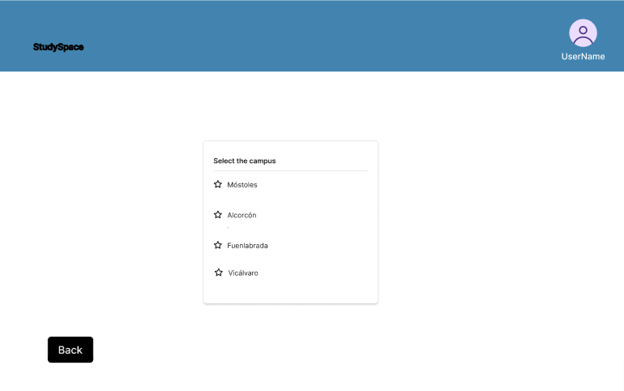

# 2025-StudySpace

---

## 📜 Introducción

---

## 📌 Fase 1
### Prototipos de pantallas
Prototipos de las pantallas finales de la aplicación web y una breve descripcion debajo de cada una, explicando su funcionalidad y sentido:

* **Pantalla de incio**
  
* **Pantalla de registrarse**
  
* **Pantalla de inciar sesion**
  
* **Pantalla seleccionar campus**
  
* * **Pantalla seleccionar dia y hora para la reserva**
  
* * **Pantalla seleccionar aula dentro de ese campus y esa fecha**
  
* * **Pantalla seleccionar opciones del administrador**
  
* **Pantalla seleccionar opciones de aulas para el administrador**
  
* **Pantalla crear nuevas aulas en el servicio**
  
* **Pantalla selecionar el aula a editar o borrarla**
  
* **Pantalla editar aulas existentes**
  
* **Pantalla seleccionar usuario para el administrador**
  
* **Pantalla administrar al usuario correspondiente como administrador**
  

### Diagrama de Navegación

### Funcionalidades diferentes tipos de usuarios

### Diagrama de Entidades

.png)

---

## 📌 Fase 2

