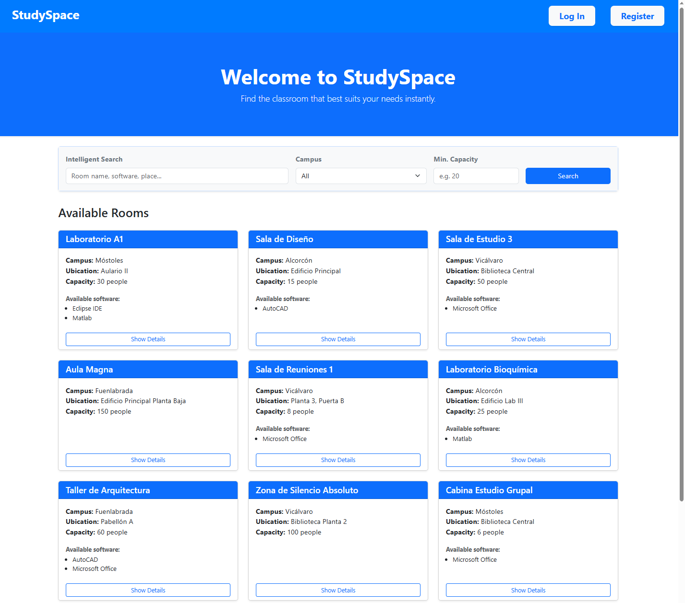

# 2025-StudySpace

---

## 📜 Introducción
StudySpace es una aplicación web diseñada para gestionar de manera eficiente la reserva de aulas de informática en un entorno universitario. El objetivo principal de esta aplicación web es ofrecer a los estudiantes, profesores y administradores una plataforma intuitiva que permita consultar la disponibilidad de los espacios, visualizar sus características y realizar reservas de forma sencilla.

---
## 👨‍💻 Autores
* **Alumno:** Guilermo Arenal Estebaranz
* **Tutor:** Michel Maes Bermejo

---
## 📚 Documentación
En los siguientes documentos se detalla toda la información relevante sobre el proyecto:

| Documento | Descripción |
| :--- | :--- |
| [**executionInstructions.md**](docs/executionInstructions.md) | Instrucciones para la ejecucion de la aplicación. |
| [**F01_analysis.md**](docs/F01_analysis.md) | Prototipos de pantallas (UI), Diagramas de Navegación y Modelo E/R. |
| [**F01_requirements.md**](docs/F01_requirements.md) | Objetivos, Actores y Tabla de funcionalidades detallada. |
| [**F01_methodology.md**](docs/F01_methodology.md) | Metodología de desarrollo y Planificación (Diagrama de Gantt). |

---

