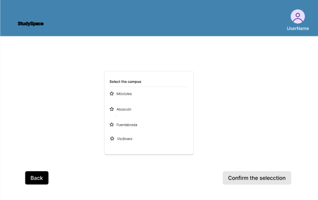
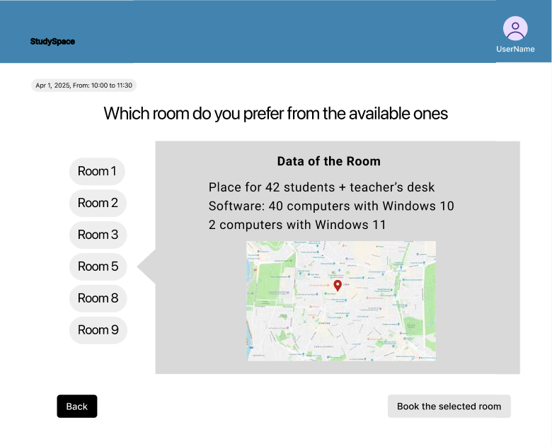
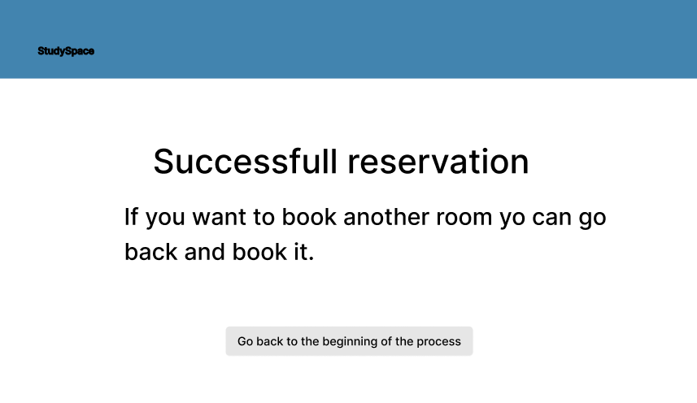

# 2025-StudySpace

---

## 📜 Introducción

---

## 📌 Fase 1
### Prototipos de pantallas
Prototipos de las pantallas finales de la aplicación web y una breve descripcion debajo de cada una, explicando su funcionalidad y sentido:

* **Pantalla de incio**
  
* **Pantalla de registrarse**
  
* **Pantalla de inciar sesion**
  
* **Pantalla seleccionar campus**
  
* * **Pantalla seleccionar dia y hora para la reserva**
  
* **Pantalla seleccionar aula dentro de ese campus y esa fecha**

Aquí seran capaces de comprobar la información y detalles del aula proporcionados para los diferentes tipos de usuarios.
  
* * **Pantalla seleccionar opciones del administrador**
  
* **Pantalla seleccionar opciones de aulas para el administrador**
  
* **Pantalla crear nuevas aulas en el servicio**
  
* **Pantalla selecionar el aula a editar o borrarla**
  
* **Pantalla editar aulas existentes**

Con un campo especial para activar o desactivar la disponibilidad del aula si la situación (obras, reformas, ...) lo requiere.
  
* **Pantalla seleccionar usuario para el administrador**
  
* **Pantalla administrar al usuario correspondiente como administrador**
  
* **Pantalla para editar el perfil de usuario**
  
* **Pantalla de exito al reservar un aula correctamente**
  
* **Pantalla para recordar registrarse al usuario anónimo**
  

### Diagramas de Navegación
Diagrama de navegación para reservar un aula y ver su disponibilidad.

.png)

Diagrama de navegación de la acciones posibles siendo un administrador.

.png)

### Funcionalidades diferentes tipos de usuarios

| Funcionalidades                                             | Usuario Anónimo | Usuario Registrado | Usuario Administrador |
|-------------------------------------------------------------|:---------------:|:------------------:|:---------------------:|
| Visualizar los detalles del aula (software, ubicación, ...) |        ✅        |         ✅          |           ✅           |
| Visualizar la disponibilidad de las aulas                   |        ✅        |         ✅          |           ✅           |
| Crear/Cancelar tu propia reserva                            |                 |         ✅          |           ✅           |
| Cancelar las reservas de otros usuarios                     |                 |                    |           ✅           |
| Modificar/Borrar información del perfil                     |                 |         ✅          |           ✅           |
| Borrar otros usuarios o reservas de sus perfiles            |                 |                    |           ✅           |
| Añadir/Modificar/Borrar aulas                               |                 |                    |           ✅           |

### Diagrama de Entidades

.png)

---

## 📌 Fase 2

