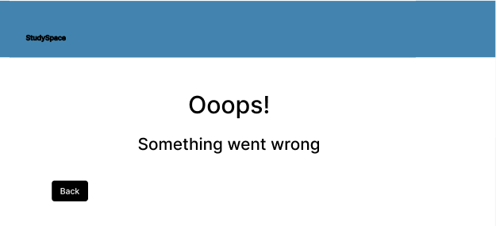

## 📌 Fase 1
### Prototipos de pantallas
Prototipos de las pantallas finales de la aplicación web y una breve descripcion debajo de cada una, explicando su funcionalidad y sentido:

* **Pantalla de incio**

Es la pantalla inical donde comenzamos a navegar por la aplicación.

  
* **Pantalla de registrarse**

Pantalla pensada para crear nuevos usuarios con su nombre y correo electrónico.

  
* **Pantalla de inciar sesion**

Pantalla para que los usuarios ya existentes puedan acceder a la aplicación. Con un apartado para mandar un correo de vuelta si olvidan su contraseña.

  
* **Pantalla seleccionar si buscar reserva por aula o por fecha**

Pantalla para elegir si empezar buscando por aula o por fecha. 

A partir de estas pantallas aparecera el 
nombre de usuario y foto si son usuarios registrados/administradores y tienen una. De no ser asi aparecera el 
logo y nombre por defecto y no les dejara acceder a ninguna de las funfionalidades del perfil.

* **Pantalla seleccionar aula**

Pantalla para seleccionar un aula de entre todas las existentes, por si nuestro requisito no es 
que este disponible a una hora en concreto como poder reservar un aula en concreto.

* **Pantalla seleccionar dia y hora del aula seleccionada**

Pantalla con un calendario que mostrara en función de la disponibilidad del aula seleccionada,
con rojo los dias que no esta disponible o esta llena todo el día y con amarillo
los dias que hay bastantes reservas en ese aula pero aun queda algún hueco que coger.
De los dias que se seleccione se podra ver que horas queda el aula disponible sin reserva.

* **Pantalla seleccionar campus**

Pantalla para seleccionar un campus de entre los disponibles.

  
* **Pantalla seleccionar día y hora para la reserva**

Calendario donde poder seleccionar el día y en base a eso apareceran las horas disponibles para elegir abajo en ese día
Se seleccionara una hora de entrada y una de salida.

  
* **Pantalla seleccionar aula dentro de ese campus y esa fecha**

Aquí seran capaces de comprobar la información y detalles del aula proporcionados para los diferentes tipos de usuarios.
En esta pantalla solo saldran las aulas que esten disponibles en la franja horaria seleccionada.

  
* **Pantalla seleccionar opciones del administrador**

Página principal donde salen las opciones que tiene el administrador justo despues de registrarse.

  
* **Pantalla seleccionar opciones de aulas para el administrador**

Pantalla para ver y seleccionar de entre todas las opciones que tiene disponibles el administrador para las aulas.

  

* **Pantalla estadísticas de las aulas**

Pantalla para ver las estadísticas por día de ocupación de las aulas.

* **Pantalla crear nuevas aulas en el servicio**

Recoge el nombre, capacidad, campus, edificio, planta, ubicación exacta y software de el aula a crear.

  
* **Pantalla selecionar el aula a editar o borrarla**

Aquí apareceran todas las aulas existentes disponibles para borrarse o editarse.

  
* **Pantalla editar aulas existentes**

Igual a los datos recopilados en la pantalla de crear aula
pero con un campo especial para activar o desactivar la disponibilidad del aula si la situación (obras, reformas, ...) lo requiere.

  
* **Pantalla seleccionar usuario para el administrador**

Menu para el administrador donde poder seleccionar de entre todos los usuarios existentes.

  
* **Pantalla administrar al usuario correspondiente como administrador**

Pantalla para permitir al administrador ver la información de cierto usuario o borrarlo o borrar una reserva 
suya de haber algun problema con ello. También saldran todas las reservas realizadas por ese usuario, solo 
dejara borrar las que aun esten vigentes. Estaran ordenadas las reservas de más reciente a más antigua.

  
* **Pantalla para editar el perfil de usuario**

Pantalla que nos permite personalizar el perfil cambiando el alias, icono, o nuestro email o reservas de ser necesario.
Aquí saldran todas nuestras reservas como un historial.

  

* **Pantalla de exito al reservar un aula correctamente**

Pantalla de confirmación que muestra que la reserva se ha completado correctamente.

  

* **Pantalla para recordar registrarse al usuario anónimo**

Pantalla que recuerda al usuario anónimo que la función de reservar está disponible solo para usuarios registrados o administradores.

  

* **Pantalla de error**

Pantalla de aviso en caso de que ocurra algún error durante la navegación por la aplicación.

  

### Diagramas de Navegación

* **Diagrama de navegación para reservar un aula y ver su disponibilidad.**

.png)

* **Diagrama de navegación de la acciones posibles siendo un administrador.**

.png)

### Diagrama de Entidades

