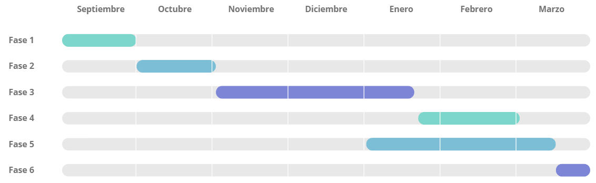

### 🛠️ Metodología
El desarrollo seguirá un enfoque iterativo y secuencial, con entregas periódicas y revisión por el tutor en cada fase.

* **Fase 1:** Definición de funcionalidades y pantallas (Finalización: 30 septiembre)

* **Fase 2:** Configuración repositorio, CI y Sonar (Finalización: 3 noviembre)

* **Fase 3:** Funcionalidad básica con pruebas: Unit, Int y E2E (Finalización: 1 diciembre)

* **Fase 4:** Versión 0.1 - Funcionalidad completa y Docker (Finalización: 5 enero)

* **Fase 5:** Memoria (Finalización: 15 enero)

Diagrama de Gantt:

