## Documentación de pruebas de carga y concurrencia

El objetivo de estas pruebas es validar el rendimiento de la aplicación bajo estrés, evaluar la correcta distribución del tráfico mediante el balanceador de carga (HAProxy) y confirmar que las políticas de concurrencia de reservas operan correctamente sin permitir solapamientos.

### Entorno de pruebas (hardware y software)

Las pruebas que se han ejecutado en un entorno local en una máquina con las siguientes especificaciones:

#### Especificaciones de hardware (máquina local):

##### Fases 0 y 1 (máquina local)

Estas pruebas se llevaron a cabo en mi ordenador local con estas especificaciones:

- Sistema Operativo: [ Windows 10 Home (Versión 22H2, arquitectura de 64 bits) ]

- Procesador (CPU): [Intel(R) Core(TM) i7-1065G7 CPU @ 1.30GHz - 1.50 GHz. Cuenta con 4 núcleos físicos y 8 procesadores lógicos.]

- Memoria RAM: [ 8 GB ]

- Almacenamiento: [238 GB SSD ]

##### Fase 2  (AWS)
En esta fase se desplegó la infraestructura en Amazon Web Services (AWS) mediante una plantilla de CloudFormation, utilizando recursos limitados correspondientes a la capa gratuita para establecer un entorno de pruebas controlado y de bajo coste:

- **Instancia EC2 (Servidor de Aplicaciones):** instancia `t3.micro` (2 vCPU, 1 GB de memoria RAM), ejecutando una única instancia contenerizada de la aplicación mediante Docker, sin réplicas ni políticas de auto-escalado activas.

- **Base de Datos RDS (Persistencia Relacional):** 1x instancia de base de datos `db.t3.micro` ejecutando MySQL 8.0 (2 vCPU, 1 GB de memoria RAM y 20GiB de Almacenamiento), configurada de forma aislada e independiente del servidor de aplicaciones.

- **Almacenamiento S3:** Un bucket de AWS S3 para la persistencia y distribución de imágenes asociadas a los espacios universitarios y fotos de perfil de los usuarios, sustituyendo el almacenamiento local basado en MinIO de las fases previas.

##### Fase 3  (AWS)
Despliegue parecido al de la fase 2 a nivel de infraestructura pero con algunos cambios:

- **Capa de Cómputo Serverless (AWS Fargate y ECS):** Se elimina la instancia EC2 reemplazándola por una ECS. La capacidad computacional se aprovisiona mediante tareas administradas en Fargate. Cada tarea (réplica) tiene un hardware estrictamente limitado a 0.25 vCPU y 512 MB de memoria RAM. El sistema parte con una base de 2 réplicas repartidas en diferentes Zonas de Disponibilidad hasta un máximo de 5.

- **Red y Balanceo:** Inclusión de un Application Load Balancer (ALB) apoyado por una distribución de Amazon CloudFront para actuar como pasarela de entrada (gestionando puertos 80 y 443 HTTPS) y repartir el tráfico equitativamente.

- **Base de Datos RDS (Persistencia Relacional):** 1x instancia de base de datos `db.t3.micro` ejecutando MySQL 8.0 (2 vCPU, 1 GB de memoria RAM y 20GiB de Almacenamiento). Mantiene exactamente la misma capacidad que en la fase 2.

- **Almacenamiento S3:** Un bucket de AWS S3 para las imágenes (misma configuración que la fase 2).

#### Especificaciones de software:

##### Fases 0 y 1

- Docker Desktop v4.29.0 configurado con el backend de WSL 2 (Windows Subsystem for Linux).
  Debido a esta configuración, los límites de recursos (CPU, memoria RAM, ...) no son estáticos, sino que son gestionados y asignados dinámicamente por el propio sistema operativo Windows según la demanda de los contenedores.

- 1 Balanceador de carga HAProxy (v2.8).

- 3 Réplicas de la aplicación.

- 1 Contenedor MySQL (v8.0).

- 1 Contenedor MinIO. (latest)

##### Fase 2

- 1 única instancia docker con la aplicación contenedorizada (EC2).

- 1 única instancia de base de datos MySQL (RDS).

- 1 única instancia de almacenamiento de ficheros (Bucket S3).

##### Fase 3
- 1 instancia Elastic Container Service (ECS) con varias tareas actuando como réplicas de la aplicación.

- Políticas de Auto-escalado activo (Target Tracking Scaling) configuradas dinámicamente para mantener el consumo medio de CPU al 70%, permitiendo a la arquitectura escalar entre un mínimo de 2 y un máximo de 5 réplicas concurrentes.

- Distribución CloudFront y Application Load Balancer (ALB) encargados del enrutamiento HTTP/HTTPS hacia las tareas vivas.

- 1 única instancia de base de datos MySQL(RDS).

- 1 única instancia de almacenamiento de ficheros (Bucket S3).

### Instrucciones de Ejecución

Para ejecutar las pruebas de carga, se han seguido los pasos descritos al final del archivo [**executionInstructions.md**](docs/executionInstructions.md)

### Herramienta y Escenario de Prueba

Se ha utilizado Artillery en local conectado a Artillery Cloud para la captura y visualización de telemetría.
El escenario simulado por cada Usuario Virtual (UV) replica el comportamiento real dentro de la aplicación de un usuario registrado
ya que se espera que provenga de estos la gran mayoría de la demanda de la aplicación. El flujo de acciones de los UV en las dos primeras fases es el siguiente:

Petición POST a /api/auth/login para autenticación.

Petición GET a /api/auth/me para obtener datos de sesión.

Petición GET a /api/rooms para listar espacios disponibles.

Petición POST a /api/reservations para reservar una sala, se han programado varias peticiones compitiendo por la misma sala (roomId: 1) y en la misma franja horaria para comprobar la respuesta concurrente de la aplicación ante el estrés.

Petición POST a /api/auth/logout para cerrar la sesión.

### Fase 0(load-test-phase-0): Prueba de concurrencia local (sin balanceador de carga)

Esta prueba establece una línea base atacando directamente a una única instancia del backend desplegada en local (http://127.0.0.1:8080/).

- Configuración de carga: 10 usuarios/segundo durante 5 segundos (Total: 50 Usuarios).

- Resultados Esperados: El sistema debe gestionar el bloqueo a nivel de base de datos. De las 50 peticiones concurrentes para reservar la misma sala, se espera obtener exactamente un código HTTP 201 (reserva exitosa) y 49 códigos HTTP 400 (rechazo por concurrencia), demostrando que el bloqueo de la base de datos funciona como se espera.

- Resultados de ejecución:
  - Completados: 50 UVs (100% de éxito en ejecución).
  - Tiempos de respuesta: Mediana (p50) de 109ms y un p95 de 433ms.

  - Validación de Concurrencia: De las 50 peticiones concurrentes para reservar la misma sala, se obtuvo exactamente un código HTTP 201 y 49 códigos HTTP 400, demostrando que el bloqueo de la base de datos funciona como se espera.

  - Captura de pantalla de Artillery Cloud de este test:

    
    [Enlace al reporte completo en PDF](artillery_reports/artillery-test-0.pdf)

- Conclusiones de la prueba: La aplicación maneja correctamente la concurrencia a nivel de base de datos, permitiendo solo una reserva exitosa y rechazando las demás. Sin embargo, el tiempo de respuesta p95 de 433ms indica que bajo esta carga, la aplicación puede experimentar cierta latencia, lo que sugiere que la arquitectura monolítica sin balanceo de carga puede no ser óptima para manejar cargas más altas.

### Fase 1A(load-test-phase-1): Prueba de carga y concurrencia local sostenida en arquitectura distribuida (con balanceador de carga)

Esta prueba evalúa la aplicación contenerizada completa (el docker-compose-dev.yml para desarrollo), atacando al balanceador de carga HAProxy (https://localhost/api) que funciona con un Round Robin gestionando las 3 réplicas de la aplicación.

- Configuración de carga:
  - Fase de calentamiento (Warm up): 15 segundos a 2 UVs/seg.

  - Fase de carga sostenida: 30 segundos a 3 UV/seg (se tuvo que bajar de 5 UV/seg a 3 UV/seg debido a que, de lo contrario, la CPU no daba abasto a tantas peticiones y algunas fallarían por ETIMEDOUT. Aun a pesar de este ajuste, solo los test iniciales que se realizan están libres de ETIMEDOUT, por lo que esta es la cifra límite de aforo para la aplicación en local).

  - Total generado: 120 Usuarios.

- Algoritmo de Balanceo: Dynamic Round Robin.

- Resultados Esperados: El sistema debe distribuir la carga entre las 3 réplicas del backend, manteniendo tiempos de respuesta razonables. De las 120 peticiones concurrentes para reservar la misma sala, se espera obtener exactamente un código HTTP 201 (reserva exitosa) y 119 códigos HTTP 400 (rechazo por concurrencia), demostrando que el bloqueo de la base de datos sigue funcionando correctamente incluso bajo una carga más alta y distribuida.

- Resultados de ejecución:
  - Completados: 118 UVs completados con éxito. Hubo 2 fallos menores por ETIMEDOUT (1.67%), algo esperado al saturar la red interna de Docker en localhost y no disponer de más recursos para estos 2 usuarios mostrando que el umbral tolerable para mi aplicación esta en 3 usuarios por segundo ya que pruebas más alla de eso generan muchos más usuarios con errores ETIMEDOUT y con 3 usuarios por segundo el primer test que se corre de artillery es capaz de pasar completamente limpio y al segundo ya comienzan a aparecer errores de ETIMEDOUT.
  - Tiempos de respuesta: Mediana (p50) de 34ms y un p95 de 105ms.

  - Captura de pantalla de Artillery Cloud de este test:

    
    [Enlace al reporte completo en PDF](artillery_reports/artillery-test-1A-primero.pdf)

  - Captura de pantalla de Artillery Cloud de este test con mas usuarios por segundo para mostrar la diferencia y el aforo limite de la aplicación en local para este test:

    
    [Enlace al reporte completo en PDF](artillery_reports/artillery-test-1A-segundo.pdf)

- Conclusiones de la prueba: A pesar de inyectar más del doble de usuarios virtuales que en la Fase 0, la arquitectura distribuida redujo el tiempo de respuesta p95 de 433ms a 162ms. Nuevamente, la regla de concurrencia se mantuvo sólida: 1 única reserva exitosa (HTTP 201) y 117 rechazos controlados (HTTP 400).

### Fase 1B(load-test-phase-1-heavy): Prueba de carga de procesamiento intensivo en entorno local

Tras validar la concurrencia y el limite de usuarios por segundo en local en mi máquina en la prueba anterior(1A), esta prueba busca estresar la CPU y la base de datos mediante endpoints que requieren cálculos complejos, búsquedas avanzadas y agregaciones de datos.
Con el fin de evaluar el rendimiento de la arquitectura ante lógica de negocio costosa aprovechando propiedades de la aplicación como:

- Hibernate Search: Búsquedas difusas (fuzzy search) y full-text.

- Cálculos geográficos: Uso de la fórmula de Haversine para distancias entre campus.

- Generación de mapas de calor: Procesamiento iterativo de calendarios y disponibilidad.

- Estadísticas dinámicas: Agregaciones en tiempo real de la ocupación.

- Configuración de carga:
  - Fase de calentamiento: 15 segundos a 2 UV/seg.

  - Fase de carga sostenida: 30 segundos a 2 UV/seg (se tuvo que bajar de 3 UV/seg a 2 UV/seg debido a que, de lo contrario, la CPU no daba abasto a tantas peticiones).

  - Total generado: 90 Usuarios (flujo completo de 6 peticiones pesadas por usuario).

- Algoritmo de Balanceo: Dynamic Round Robin.

- Resultados Esperados: El sistema debe gestionar la carga de procesamiento intensivo sin degradar significativamente los tiempos de respuesta. Se espera que el sistema mantenga,aunque sean superiores, unos tiempos de respuesta razonables no muy distantes a los obtenidos en la prueba 1A, demostrando que la arquitectura puede manejar operaciones complejas incluso bajo carga.

- Resultados de ejecución:
  - Completados: 90 UVs (100% de éxito).

  - Tiempos de respuesta: Mediana (p50) de 34ms y un p95 de 116ms. A pesar de la complejidad de los cálculos (Smart Search y Calendar), la distribución en 3 réplicas permite mantener latencias por debajo de los 100ms para el 95% de los usuarios.

  - Captura de pantalla de Artillery Cloud de este test:

    
    [Enlace al reporte completo en PDF](artillery_reports/artillery-test-1B.pdf)

Conclusiones de la prueba: La aplicación demuestra una alta capacidad de cómputo en local manteniendo unos tiempos de respuesta razonables para los procesos que se le piden, a pesar de las limitaciones del hardware sobre el que se ejecutan las pruebas, ante consultas bastante estresantes debido a la cantidad de computo que llevan.

### Fase 2A(load-test-phase-2-**stress**): Prueba de **Esfuerzo** en entorno AWS con una réplica

El objetivo de esta prueba fue estresar la capacidad de procesamiento de la infraestructura en la nube bajo un escenario que simula el comportamiento de picos de demanda. Se buscó forzar los endpoints críticos del backend mediante tres perfiles de usuarios simulados:

- **Perfil de Consulta Pura (70% de la carga):** Usuarios que acceden a la plataforma para listar y filtrar espacios universitarios (`/api/search/rooms`), simulando un comportamiento pasivo.
- **Perfil de Reserva Directa (20% de la carga):** Usuarios activos que efectúan consultas y proceden a intentar registrar de forma inmediata una reserva fija (`/api/reservations`).
- **Perfil de Búsqueda Inteligente (10% de la carga):** Usuarios que invocan de manera intensiva el algoritmo avanzado de sugerencias alternativas y disponibilidad temporal (`/api/reservations/smart-search`).

#### Configuración de la carga:
La primera prueba se estructuró en cuatro fases progresivas de inyección en Artillery: 
una fase de calentamiento a 2 UV/seg durante 60 segundos, seguida de una rampa agresiva incrementando hasta 10 UV/seg durante 120 segundos, aproximándose al límite teórico entre 10 y 12 UV/seg en los siguientes 120 segundos, y finalizando con un pico sostenido de 12 UV/seg durante 120 segundos adicionales.

La segunda prueba se estructuró también en cuatro fases progresivas: 
las 2 primeras fases fueron iguales a las del test anterior después seguimos entre 10 y 15 UV/seg en los siguientes 120 segundos, y finalizamos con un pico sostenido de 17 UV/seg durante 120 segundos adicionales.

#### **Primera prueba**
#### Resultados de ejecución de la primera prueba:
- **Completados con éxito lógico:** 100% de los usuarios virtuales completaron sus flujos de navegación sin provocar caídas del servicio de aplicaciones o interrupciones críticas del contenedor (cero errores HTTP 500).
- **Rendimiento por Endpoint:**
  - `/api/auth/login`, `/api/search/rooms` y `/api/reservations/smart-search`: 100% de respuestas exitosas (HTTP 200). La infraestructura absorbió eficientemente las búsquedas de texto plano indexadas con Apache Lucene / Hibernate Search.
  - `/api/reservations`: Se registró un 0,37% (4 respuestas del total mandado a este endpoint) de las respuestas como **HTTP 400 Bad Request** debido a la generación aleatoria de reservas que alguna coincidencia accidental genera, frente a las 1065 (99,63%) confirmaciones exitosas con código **HTTP 201 Created**.
  - **Tiempos de respuesta (Latencia):** Mientras que las lecturas mantuvieron una mediana (p50) baja y estable en torno a los 133ms y media de 190ms, los intentos de escrituras concurrentes provocaron picos de degradación en los percentiles más altos, alcanzando un p95 de 478ms y un p99 de 983 ms.

#### Captura de pantalla de Artillery Cloud de la primera prueba:

[Enlace al reporte completo en Artillery Cloud](https://app.artillery.io/opmgtbvasi7hy/load-tests/tcgay_x4yjnawbjrekhhebmx3x7eznmeyxr_ch6t)

#### Conclusiones de la primera prueba de esfuerzo:
En la gráfica se pueden apreciar ciertos picos al inicio de cada fase de este test cuando los usuarios subían drásticamente. A partir de los 10 usuarios en adelante al finalizar la fase 2, estos picos se volvieron más y más pronunciados en cuanto al tiempo máximo de espera de p95 de la aplicación. 
Si nos fijamos en la línea naranja, verde y azul, veremos que justo cuando la aplicación presenciaba una caída en la demanda de peticiones y un pico en los usuarios activos en la aplicación, justo en ese momento los tiempos de respuesta se disparaban puesto que la aplicación no pudo procesar tan rápido ese aumento en los usuarios activos. 
Esto nos muestra que nuestra aplicación cuando esta rondando los 90 usuarios activos aproximadamente (dentro de las limitaciones que ofrece una replica en la capa gratuita de AWS) permanece con unos tiempos de respuesta bajos acordes al número de peticiones que llegan, pero cuando estos usuarios activos suben por encima de los 90, la aplicación comienza a no dar a basto para atender todas las peticiones y comienza a ponerlas en cola, lo que genera que se disparen los tiempos de respuesta. Aun asi en este test se puede apreciar que los 3600 usuarios generados pudieron completar con éxito sus cometidos (salvo esos 4 errores 400 debidos a unas reservas que no cumplian con las reglas de negocio de la aplicación debido la generación aleatoria de estas para lograr abastecer más de 1000 solicitudes de reserva).

Esto muestra que la aplicación soporta flujos de hasta 12 usuarios nuevos siendo solo 1 sola réplica, aunque la velocidad de la repuesta se deteriore a partir de 10 usuarios nuevos.

#### **Segunda prueba**
#### Resultados de ejecución de la segunda prueba:
- **Completados con éxito lógico:** El 63,38% de los usuarios virtuales completaron sus flujos de navegación sin provocar errores HTTP 500. En cambio, un 36,62% de los usuarios sufrieron estos errores 500 debido al tiempo límite de espera en cola por la saturación de esta prueba.
- **Rendimiento por Endpoint:**
  - `/api/auth/login`, `/api/search/rooms` y `/api/reservations/smart-search`: 100% de respuestas exitosas (HTTP 200).
  - `/api/reservations`: Se registró un 0,16% (1 respuesta del total mandado a este endpoint) de las respuestas como **HTTP 400 Bad Request** debido a la generación aleatoria de reservas que alguna coincidencia accidental genera, frente a las 628 (99,84%) confirmaciones exitosas.
  - **Tiempos de respuesta (Latencia):** La mediana (p50) subió hasta los 268 ms (más del doble que en la prueba anterior), y la media también subió bastante, pasando de los 190 ms hasta los 1,3 segundos (más de 6 veces el tiempo anterior). Los intentos de escritura también aumentaron drásticamente, alcanzando un p95 de 6,9 segundos y un p99 de 7,8 segundos. La peor respuesta registrada fue de 8 segundos, puesto que más allá de este tiempo la aplicación no respondió a las peticiones.

#### Captura de pantalla de Artillery Cloud de la segunda prueba:

[Enlace al reporte completo en Artillery Cloud](https://app.artillery.io/opmgtbvasi7hy/load-tests/tebjh_y6g9gaw5e6ejd4cjyq7pjy9kpn639_bh8b)

#### Conclusiones de la segunda prueba de esfuerzo:
Al mantenerse igual las 2 primeras fases la gráfica genera resultados similares en estas. No es hasta la 3 fase que vemos cambios significativos donde podemos apreciar que los usuarios comienzan a fallar en cuanto las respuestas p95 comienzan a tardar mas debido al exceso de usuarios activos en la aplicación. Como podemos comprobar antes de fallar los usuarios activos en la aplicación rondan los 100 usuarios (120 en el momento antes de comenzar a perder peticiones por no dar a basto) como mencionamos en las conclusiones del test anterior con unos 90 usuarios activos a la vez pudimos ver que la aplicación comenzaba a tardar bastante tiempo pero lograba reponderlos a todos. Sin embargo, aquí con 100 usuarios activos simultáneamente vemos que la aplicación comienza a fallar.

#### Conclusiones generales de las pruebas de esfuerzo:
Estos dos test nos muestran que el cuello de botella de la aplicación se encuentra entre los 90 y 100 usuarios activos y entre los 12 y 15 usuarios generados por segundo, más alla de este límite (para la versión gratuita de AWS y una sola replica disponible) la aplicación no es capaz de abastecer a todas las peticiones pendientes. 
También nos muestran estos resultados que el endpoint más crítico de la aplicación (debido a las comprobaciones que se llevan a cabo antes de completar una reserva, así como el bloqueo de la base de datos para evitar reservas duplicadas en diferentes usuarios) es el endpoint de /api/reservations/ aunque el endpoint más lento sea api/reservations/smart-search debido a que sus tiempos son parejos a los de las reservas pero muchos menos usuarios estaban atacando este endpoint.
Después de estos 2 endpoints el más rápido en base a los test realizados seria la barra de búsqueda de aulas mediante api/search/rooms y el segundo más rápido el propio inicio de sesión de la página web en /api/auth/login. Estos endpoints, a diferencia de los anteriores que recibían menor carga de usuarios para simular un comportamiento real de la aplicación, recibieron el 100% de los usuarios, todos pasaron por ellos.
Estas son las capturas de la primera prueba de estrés (aunque para esta conclusión se han comparado los resultados de más pruebas para asegurarse):

---

### Fase 2B (load-test-phase-2-**soak**): Prueba de **Resistencia** (Soak Test) en entorno AWS (Solo una réplica)

El propósito de esta fase fue someter a la instancia única de AWS a una carga continua de usuarios virtuales con el fin de evaluar la fatiga del sistema a lo largo del tiempo, vigilando el comportamiento del recolector de basura de la JVM (*Garbage Collector*), el uso sostenido del pool de conexiones de base de datos HikariCP y la posible presencia de fugas de memoria (*Memory Leaks*). Los endpoints atacados en esta prueba seran exactamente los mismos que se expusieron en la prueba anterior (Fase 2A(load-test-phase-2-stress)).

#### Limitación del plan gratuito de la herramienta Artillery Cloud:
Debido a las políticas comerciales implementadas en la plataforma de Artillery, la visualización y captura de telemetría a través de su servicio en la nube (*Artillery Cloud*) se encuentra restringida a un máximo estricto de 30 minutos de duración en su plan gratuito. Dado que una prueba de resistencia requiere analizar el comportamiento persistente del sistema operativo y de los contenedores más allá de dicho umbral temporal, se optó por una estrategia diferente. 

Se configuró Artillery para volcar todas las métricas e intervalos de telemetría del test en formato `.json`. Posteriormente, se diseñó e implementó un script automatizado en Python que procesa dicho JSON de forma local. Este script extrae de forma secuencial las métricas agregadas por periodos e implementa un generador de gráficos, garantizando gráficas con el sufiente detalle como para suplir las de *Artillery Cloud*.

#### Configuración de la carga:
La prueba se estructuró en dos fases: 
una fase de calentamiento a 2 UV/seg durante 60 segundos, seguida de una fase sostenida de 2 UV/seg durante las dos siguientes horas. Esto con el fin de mostrar una diferencia con una carga sostenida más leve que en la prueba anterior.

#### Resultados de ejecución de la prueba:
- **Volumen Total:** Se procesó un flujo de 14,520 usuarios virtuales creados, que generaron 28,979 peticiones HTTP. En esta ocasión, el 100% de las peticiones de red fueron procesadas y respondidas con éxito, logrando un flujo sin interrupciones a nivel de servidor.
- **Códigos de Estado y Errores de Flujo:**
  - Respuestas exitosas de sesión y lectura (HTTP 200): 27,524 peticiones.
  - Reservas confirmadas (HTTP 201): 1.453 peticiones.
  - Rechazos por reglas de negocio (HTTP 400):2 peticiones.
  - Timeouts de red (ETIMEDOUT): 0 peticiones.
  - Usuarios abortados por Artillery (vusers.failed): 2.971 usuarios virtuales. Tras auditar la telemetría, se constata que estos fallos no reflejan una caída ni una saturación del servidor (el backend procesó estas peticiones devolviendo respuestas HTTP 200 OK de forma fluida). El origen de estos abortos reside en un defecto de configuración del propio script de pruebas automatizado para el escenario de "Reserva Directa". La herramienta intentaba extraer un parámetro de la respuesta mediante una instrucción capture, pero debido a un desfase o agotamiento en los datos de prueba inyectados durante las 2 horas, el formato de la respuesta no contenía el campo esperado. En consecuencia, Artillery abortó internamente la ejecución de esos usuarios (Failed capture or match).
- **Estudio de Tiempos de Respuesta Sostenidos:** Bajo esta carga adaptada a la capacidad de la instancia, la latencia demostró un comportamiento excepcionalmente robusto y estable. La **mediana global (p50)** se mantuvo plana a lo largo de las dos horas de prueba marcando **125.2 ms**, alineada con una **media global de 141.2 ms**. Las latencias máximas registradas mostraron picos altamente controlados, alcanzando un **p95 de 133.0 ms** y un **p99 de 135.7 ms** en los momentos de mayor concurrencia. Esta mínima desviación estándar entre la mediana (p50) y el percentil 99 (p99) confirma la ausencia de contención en la base de datos y certifica que la infraestructura operó fluidamente.

#### Captura de las gráficas de la prueba procesadas localmente mediante el script en Python:

#### Conclusiones de la prueba de resistencia (Soak Test):
Al reducir la carga a 2 UV/s, la instancia logró un equilibrio perfecto entre la CPU consumida y la regeneración de créditos de AWS. El test demostró un éxito absoluto de infraestructura: cero caídas, cero timeouts y latencias estables durante 2 horas seguidas. Demostrando así en que franja de usuarios se encuentra el limite de mi aplicación con una sola replica desplegada en la infraestructura de AWS.

Gracias a esta prueba hemos podido sacar estas conclusiones sobre la estabilidad técnica del sistema desarrollado:

- Ausencia confirmada de Fugas de Memoria (Memory Leaks): En la prueba la línea de latencia se mantuvo absolutamente plana. Si el sistema sufriera una mala gestión de la memoria o acumulara conexiones huérfanas en la base de datos, el tiempo de respuesta habría mostrado una degradación paulatina a lo largo de las 2 horas. La JVM gestionó y limpió con gran eficiencia cada sesión finalizada.

- Dimensionamiento del Hardware en la Nube: La prueba ha acotado matemáticamente que, para una infraestructura de capa gratuita (t3.micro sin escalado), la velocidad garantizada para operaciones complejas como búsquedas y transacciones con bases de datos relacionales se sitúa en 2 usuarios concurrentes por segundo. Para volúmenes sostenidos mayores, la arquitectura demanda forzosamente escalar la máquina a instancias de mayores prestaciones (escalado vetical) o añadir réplicas manejadas por un balanceador (escalado horizontal).

También sacamos conclusiones de los endpoints, mostrando que de normal se mantiene el orden que comprobamos en la prueba anterior, de tiempo que tarda cada uno. Aunque cuando las peticiones se acumulan los tiempos de espera en estos endpoints más rapidos, en situciones muy especiales(como p95 o p99), pueden dispararse mucho más que las de los endpoints más dificiles de procesar, como pueden ser las reservas o la búsqueda inteligente de aulas alternativas a la nuestra.

---
### **Pruebas de la Fase 3**
### Fase 3(load-test-phase-3-**stress**): Prueba de **Esfuerzo** en entorno AWS con un balanceador de carga

El objetivo de esta prueba fue el mismo que el de la prueba de esfuerzo de la fase anterior, estresar la capacidad de procesamiento de la infraestructura en la nube bajo un escenario que simula el comportamiento de picos de demanda. Se buscó forzar los endpoints críticos del backend mediante los mismos tres perfiles de usuarios simulados usados en la fase anterior:

- **Perfil de Consulta Pura (70% de la carga):** Usuarios que acceden a la plataforma para listar y filtrar espacios universitarios (`/api/search/rooms`), simulando un comportamiento pasivo.
- **Perfil de Reserva Directa (20% de la carga):** Usuarios activos que efectúan consultas y proceden a intentar registrar de forma inmediata una reserva fija (`/api/reservations`).
- **Perfil de Búsqueda Inteligente (10% de la carga):** Usuarios que invocan de manera intensiva el algoritmo avanzado de sugerencias alternativas y disponibilidad temporal (`/api/reservations/smart-search`).

#### Configuración de la prueba:
La prueba se estructuró en 5 fases progresivas de inyección en Artillery, buscando no colapsar la CPU y la base de datos antes de que se llegaran a implementar algunas de las réplicas, para asi poder comprobar como el sistema se adaptaba mediante el balanceador de carga de AWS a la carga de la prueba. Se dividio en las siguinetes fases la prueba:  
una fase de calentamiento a 2 UV/seg durante 60 segundos, seguida de un incremento hasta 8 UV/seg durante 240 segundos(4 minutos), después se sostuvo la carga de 8 UV/seg en los siguientes 180 segundos(3 minutos) con el fin de que se estabilizaran las nuevas réplicas para que funcionaran para la carga con mas usuarios, se volvio a aumentar a 12 UV/seg durante otros 240 segundos y se finalizo con una pequeña fase de 120 segundos con una carga de 2 UV/seg para que volviera a un flujo calmado.

Se programo que ante un uso igual o superior al 65% de CPU se crearan nuevas réplicas de la aplicación para solventar este consumo. Las réplicas tardaron al rededor de 40 segundos en ponerse operativas, pidiendo una señal de vida de estas cada 50 segundos y retirandolas pasados 240 segundos de no recibir señal de estas mismas.

#### Resultados de ejecución de la prueba:
- **Completados con éxito lógico:** 42,11% de los usuarios virtuales completaron sus flujos de navegación completos. El resto de usuarios o bien por sobrepasar el tiempo máximo programado en las peticiones, o bien por fallo de las propias réplicas al escalar (debido a la falta de CPU en algunos momentos de la ejecución) recibieron errores HTTP 500 por ETIMEDOUT (time out).
- **Rendimiento por Endpoint:**
  - `/api/auth/login`, `/api/search/rooms`, `/api/reservations/smart-search` y `/api/reservations`: recibieron un 100% de respuestas exitosas (HTTP 200 y 201). Confirmando de esta forma que las peticiones que no se salieron del tiempo de espera fueron todas  exitosas. 
  - **Tiempos de respuesta (Latencia):** La mediana (p50) estuvo en torno a los 608ms y media de 1,3 segundos, esto junto con el p95 de 4,4 segundos y el p99 de 4,8 segundos muestra que la aplicación ante picos de estrés genera tiempos muy diferidos entre usuarios, siendo muy rapidos para algunos y muy lentos para otros. Esto también puede verse si comprobamos la diferencia entre el tiempo máximo de CPU dentro de la métricas que nos ofrece Amazon Cloud Watch.
  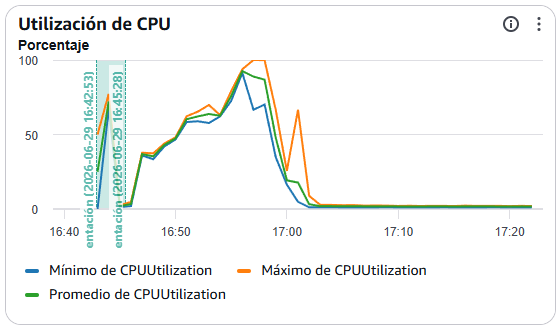
  Como se puede apreciar en la gráfica los tiempos medios llegado un punto de colapso de la CPU comienzan a diferir mucho dependiendo de si nuestra peticion esta en cola o no.

#### Captura de pantalla de Artillery Cloud de la prueba de estrés de esta fase:

[Enlace al reporte completo en Artillery Cloud](https://app.artillery.io/opmgtbvasi7hy/load-tests/tgd34_59ta5qr5jztgy5hexjzebbrwqp4n3_hxqw)

#### Capturas de pantalla de Amazon ECS Y CloudWatch de la prueba de estrés de esta fase:
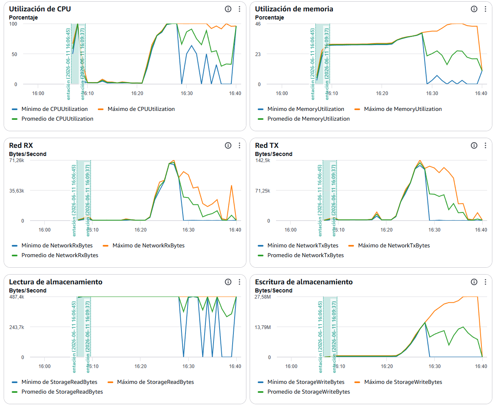
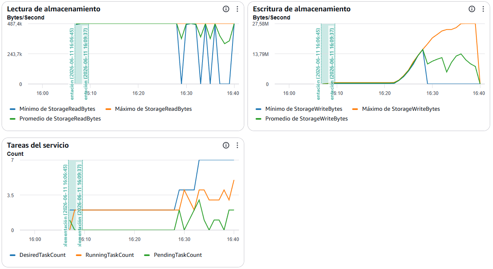
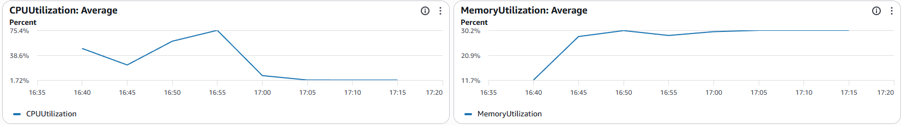

#### Conclusiones de la prueba de esfuerzo:
Como se puede apreciar en las gráficas recientemente mostradas, la aplicacion tolera muy mal los picos grandes de carga costandola mucho adaprtase a ellos por tener la CPU muy facilmente colapsada.
Al igual que se ve en la captura de pantalla del uso de CPU de Cloud Watch y ECS, con esta carga de usuarios para generar estrés a la aplicación hemos logrado saturarla llevandola casia su limite de CPU. Aunque en algunos casos denego servicio por estar hasta arriba la CPU obligando a fallar por un gran tiempo de esepera en las peticiones realizadas. 

La aplicación también ha mostrado que es capaz de escalar en estas situciones como se puede apreciar en la gráfica de Tareas del servicio del cluster ECS, siendo 7 las réplicas que idealmente querria disponer la aplicación en ese momento y unas 4 o 5 a la vez las que ha sido capaz de mantener aunque por la saturación de la CPU algunas pudieran cerrarse.

A diferencia de lo que se mostro en este mismo tipo de test de la fase 2 la aplicación ha sido capaz de gestionar menos usuarios simultaneos activos debido a que no pudo esperar por sus tiempos de respuesta superiores a 5 segundos abortando las peticiones. Obteneiendo en este pico en el mejor de los casos picos de 84 usuarios activos simultaneamente y siendo el mejor de estos picos un pico de 94 usuarios activos a la vez, como se puede apreciar en la captura de pantalla del test en Artillery Cloud.

A diferencia de su versión de la fase anterior este test lidió con más usuarios de los que la aplicación era capaz de lidiar en la fase anterior, siendo esta una diferencia de 1.800 usuarios más que el anterior primer test y 1.020 más que el segundo test, proporcionando unos resultados parecidos a los de estos test pero soportando más carga de usuarios.

---
### Fase 3(load-test-phase-3-**soak**): Prueba de **Resistencia** en entorno AWS con un balanceador de carga

El objetivo de esta prueba fue el mismo que el de la prueba de resistencia de la fase anterior, ver como se comporta la aplicación ante un flujo bajo pero constante de usuarios. Se buscó forzar los endpoints críticos del backend mediante los mismos tres perfiles de usuarios simulados usados en la fase anterior:

- **Perfil de Consulta Pura (70% de la carga):** Usuarios que acceden a la plataforma para listar y filtrar espacios universitarios (`/api/search/rooms`), simulando un comportamiento pasivo.
- **Perfil de Reserva Directa (20% de la carga):** Usuarios activos que efectúan consultas y proceden a intentar registrar de forma inmediata una reserva fija (`/api/reservations`).
- **Perfil de Búsqueda Inteligente (10% de la carga):** Usuarios que invocan de manera intensiva el algoritmo avanzado de sugerencias alternativas y disponibilidad temporal (`/api/reservations/smart-search`).

#### Configuración de la prueba:
La prueba se estructuró en 2 fases progresivas de inyección en Artillery, buscando mantener una carga aceptable para la aplicación. Comenzando por 1 minuto con 2 UV/seg seguido de otra fase de 2 horas con 4 UV/seg.

Se programo que ante un uso igual o superior al 65% de CPU se crearan nuevas réplicas de la aplicación para solventar este consumo. Las réplicas tardaron al rededor de 40 segundos en ponerse operativas, pidiendo una señal de vida de estas cada 50 segundos y retirandolas pasados 240 segundos de no recibir señal de estas mismas.

#### Resultados de ejecución de la prueba:
- **Volumen Total:** Se procesó un flujo de 28.920 usuarios virtuales creados, que intentaron generar 57.525 peticiones HTTP. De estas, el servidor logró responder a 57.508, perdiéndose el resto debido a la asfixia del hardware de AWS tras superar su límite operativo.
- **Códigos de Estado y Errores de Flujo:**
  - Respuestas exitosas de sesión y lectura (HTTP 200): 54.723 peticiones.
  - Reservas confirmadas (HTTP 201): 2.778 peticiones.
  - Rechazos por reglas de negocio (HTTP 400): 0 peticiones.
  - Timeouts de red (ETIMEDOUT): 17 peticiones cortadas por la herramienta al tardar demasiado en responder.
  - Usuarios abortados por Artillery (vusers.failed): 5.899 usuarios virtuales que no pudieron terminar su flujo por culpa de los cortes de conexión o fallos en las capturas esperadas.
- **Estudio de Tiempos de Respuesta Sostenidos:** Al analizar las peticiones que lograron completarse exitosamente, el sistema arrojó una **media global de 181,3 ms** y una **mediana (p50) de 144 ms**. La degradación por la falta de CPU se hizo evidente en los percentiles superiores, estabilizándose el **p95 en 468,8 ms** y el **p99 en 727,9 ms**. Es fundamental destacar que estas métricas representan únicamente el subconjunto de peticiones que se completaron. 

#########Revisa que el nuemero de time outs sea solo 17 con 500 usuarios fallidos#######

#### Captura de pantalla de las tablas generadas de la prueba de ressitencia de esta fase:

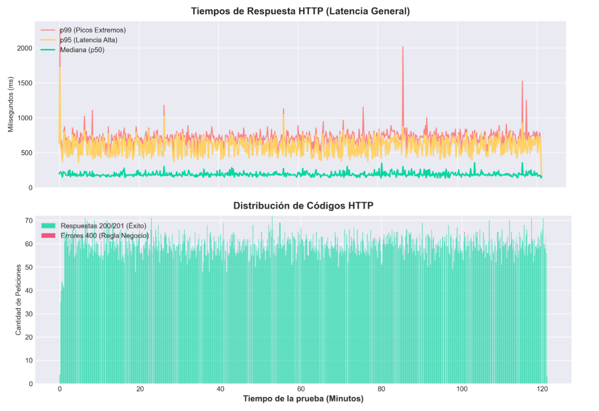
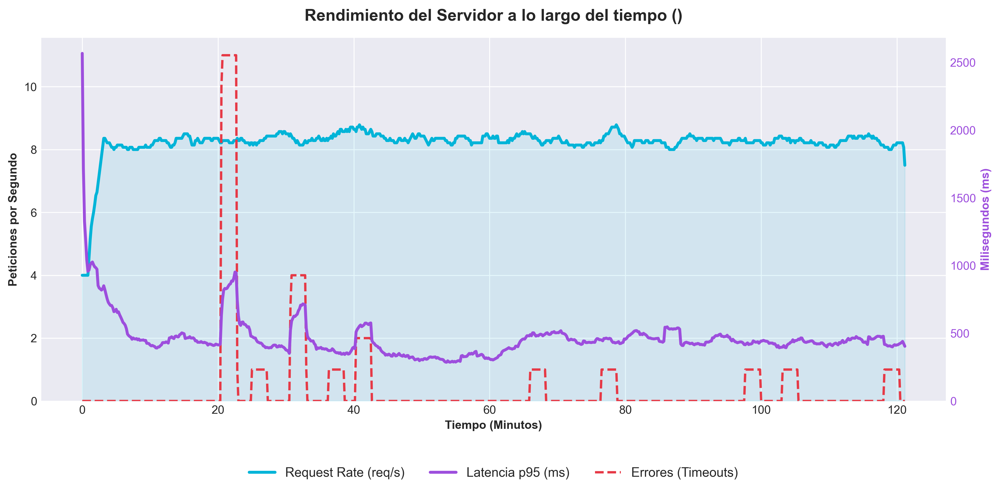
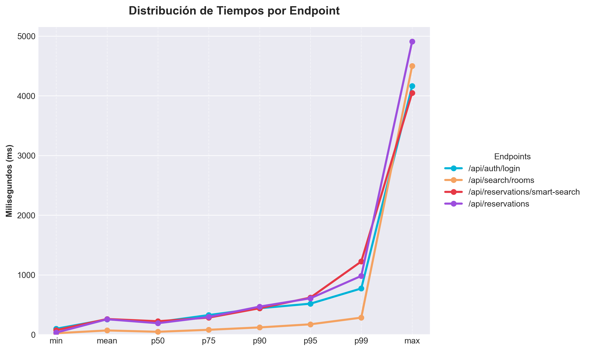

#### Capturas de pantalla de Amazon ECS Y CloudWatch de la prueba de resistencia de esta fase:
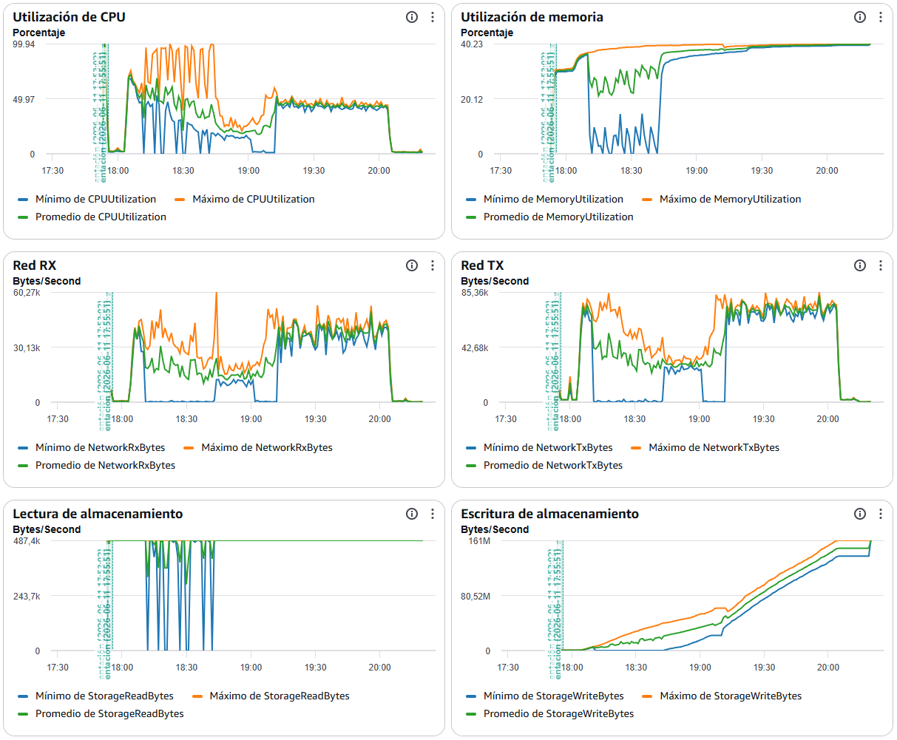
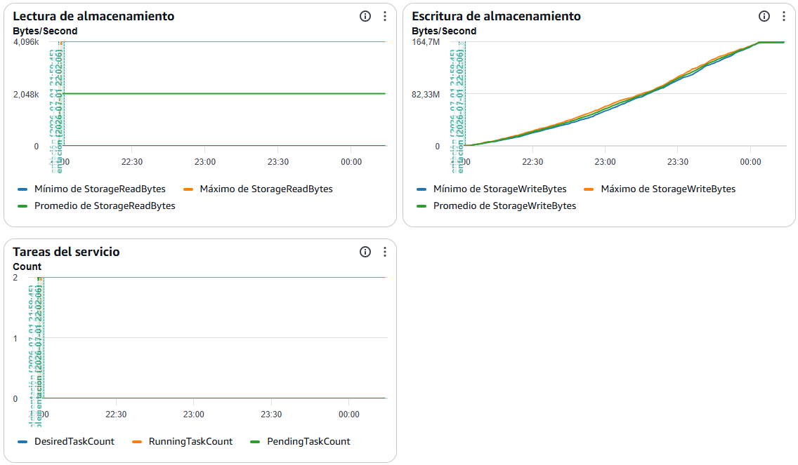
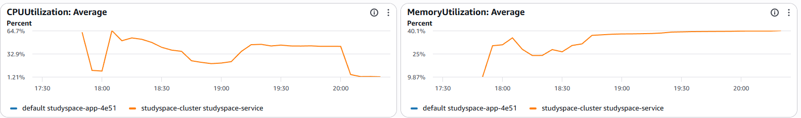

#### Conclusiones de la prueba de resistencia:
Esta prueba al ser más larga y no lanzar tantos usuarios de golpe se permite visualizar mejor como el sistema aguanta y escala ante cierto aumento en la CPU. 

Como se puede comprobar en las gráficas de utilización de CPU de ECS y CloudWatch aunque al incio reciben picos altos de demanda de CPU estos van estabilizandose llegado cierto punto del test hasta que se mantienen con unos valores estables hasta el final de este. 

En esta misma gráfica de utilización de CPU de ECS, se ve como al inicio las peticones comienzan a encolarse y el sistema empieza a crear réplicas para sostener la carga (zona donde el grafico comienza a tener diferencias grandes entre los tiempos de respuesta medios, máximos y mínimos), pero una vez la carga se logra regular los tiempos de respuesta máximos y minimos llegan a un punto medio muy cercano los unos de los otros puesto que despues de escalar ahora la infraestructura es capaz de asumir la carga a la que esta siendo sometida.

Siguiendo todo esto podemos apreciar en la gráfica de tareas de servicio de ECS como la aplicación lucha por escalar en réplicas hasta que logra un punto donde abastece perfectamente a todos los usuarios. Se queda ahi un tiempo hasta que retira algunas réplicas puesto que ya no son tan necesarias con la carga actual que no varia apenas.

También quiero añadir dos capturas más en este test puesto que creo aportan bastante, mostrando como cuando la aplicación ya es capaz de aguantar la carga comienza a quitarse los recursos que no le son necesarios:

Primera captura con bastantes réplicas:
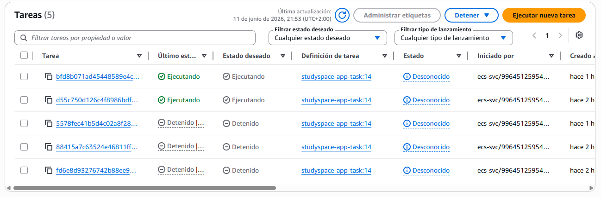

Segunda captura con menos réplicas al darse cuenta que no necesita tantas instancias:

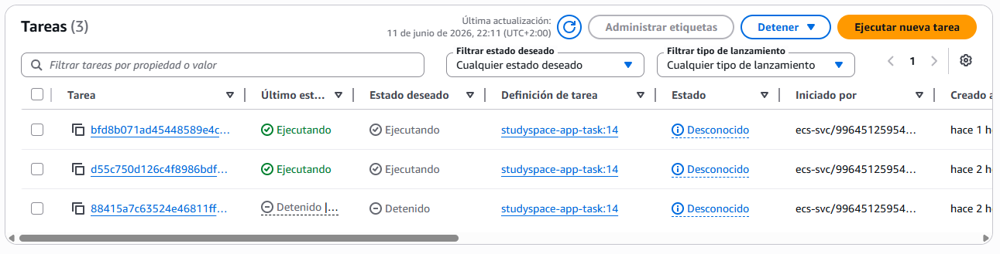

---

### Fase 3(load-test-phase-3-**spike**): Prueba de **Pico de Tráfico** en entorno AWS con un balanceador de carga

Para esta prueba se simulo un ejemplo de época de exámenes y las reservas que corresponderian a dicha etapa. A diferencia de las demas pruebas en esta se empleo el archivo javascript processor-multi-room-2.js en vez de el processor-multi-room.js debido a que se cambio la forma de hacer las reservas, ya que en una epoca de exámenes no se espera que muchos usuarios realicen reservas en el tiempo y de forma calamada. En este nuevo archivo se creo un entorno que simula reservas rápidas para antes de 15 dias desde la fecha de uso del test. De esta forma se simula mejor como de caótico seria el escenario que queremos probar.
Se buscó forzar los endpoints críticos del backend mediante perfiles de usuarios algo diferentes a los de los test anteriores:

- **Perfil de Consulta y Reserva (70% de la carga):** Usuarios que acceden a la plataforma para listar y filtrar espacios universitarios (`/api/search/rooms`), simulando un comportamiento pasivo para acto seguido proceder a reservar aula (`/api/reservations`).
- **Perfil de Búsqueda Inteligente con Reserva (30% de la carga):** Usuarios que llegan y hacen el flujo comentado en el 70% de la carga, pero antes de reservar se encuentran con el problema que por afluencia ya alguien ha ocupado el aula que ellos querian. Proceden aprovechando la búsqueda inteligente (`/api/reservations/smart-search`) para buscar otro aula viable y reservarla.

#### Configuración de la prueba:
La prueba se estructuró en 3 fases siendo la primera de 1 minuto con 2 UV/seg, seguida de una fase de 1 minuto con 25 UV/seg (este es el pico de carga al que se somete la aplicación) y fianlizando con 5 minutos a 2 UV/seg buscando ver como la aplicación responde esos siguientes 5 minutos .

Se programo que ante un uso igual o superior al 65% de CPU se crearan nuevas réplicas de la aplicación para solventar este consumo. Las réplicas tardaron al rededor de 40 segundos en ponerse operativas, pidiendo una señal de vida de estas cada 50 segundos y retirandolas pasados 240 segundos de no recibir señal de estas mismas.

#### Resultados de ejecución de la primera prueba:
- **Completados con éxito lógico:** 24,55% de los usuarios virtuales completaron sus flujos de navegación completos. El resto de usuarios o bien por sobrepasar el tiempo máximo programado en las peticiones, o bien por fallo de las propias réplicas al escalar (debido a la falta de CPU en algunos momentos de la ejecución) recibieron errores HTTP 500 por ETIMEDOUT (time out).
- **Rendimiento por Endpoint:**
  - `/api/auth/login`, `/api/search/rooms` y `/api/reservations/smart-search`: recibieron un 100% de respuestas exitosas (HTTP 200). Confirmando de esta forma que las peticiones que no se salieron del tiempo de espera fueron todas exitosas. 
  - `/api/reservations`: Un 13,76% (75 respuestas de 545 que llegaron al endpoint) fueron HTTP 400 denegando el aula debido al alto aforo programado para la prueba.

  - **Tiempos de respuesta (Latencia):** La mediana (p50) estuvo en torno a los 392ms y media de 738 ms, esto junto con el p95 de 2,7 segundos y el p99 de 5,8 segundos muestra que la aplicación dio un servicio medianamente rápido a casi todos los que logro atender antes de colapsar. 

#### Captura de pantalla de Artillery Cloud de la prueba de pico de tráfico de esta fase:

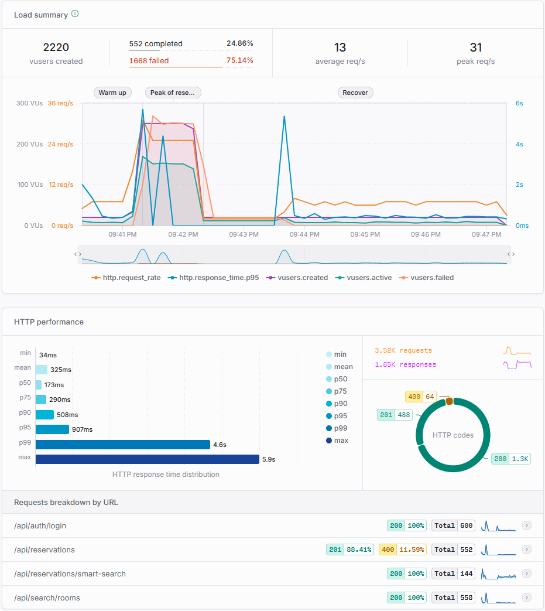
[Enlace al reporte completo en Artillery Cloud](https://app.artillery.io/opmgtbvasi7hy/load-tests/texeh_gbj6w7txjxnrjd3czbtcndxgaqa7r_nj97)

#### Capturas de pantalla de Amazon ECS Y CloudWatch de la prueba de pico de tráfico de esta fase:
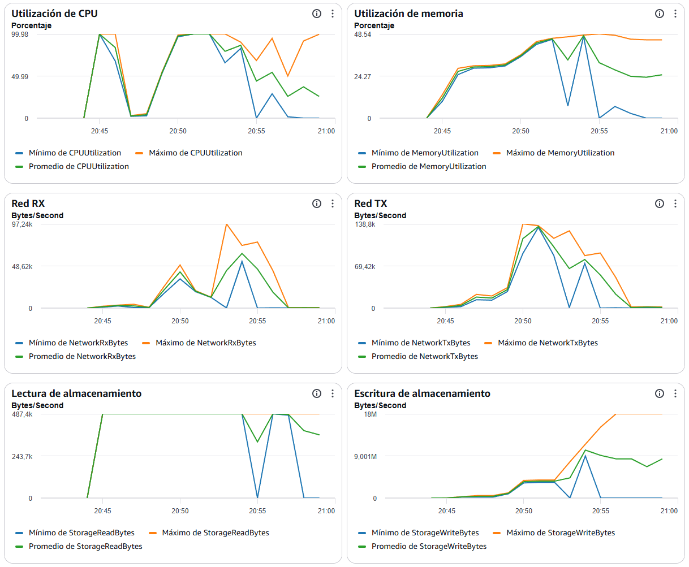
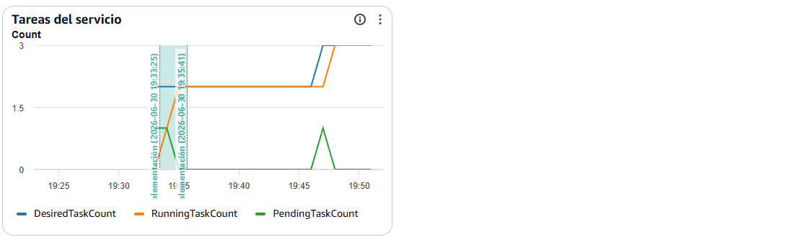
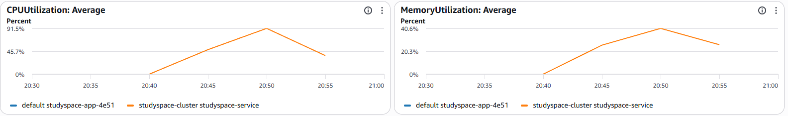

#### Conclusiones de la prueba de pico de tráfico:
Como se puede apreciar en esta prueba la aplicación no tuvo posibilidad de aguantar, ya que no tuvo tiempo siquiera de escalar para soportar la demanda como podemos ver en la gráfica de tareas del servicio de ECS.

Se puede apreciar como al igual que en las demas pruebas de este estilo cuando la CPU se ve desbordada comienza a distar mucho los porcentajes de utilización de la CPU teniendo maquinas completamente saturadas sin lograr responder a las peticiones.

A continuación se muestran las gráficas de los endpoints de Artillery Cloud ya que junto a la propia captura del pico de tráfico (usarios creados, usuarios activos, tasa de peticiones http, etc) se puede apreciar exactamente como el servicio cesa de responder ante este pico debido al exceso de peticiones por segundo:

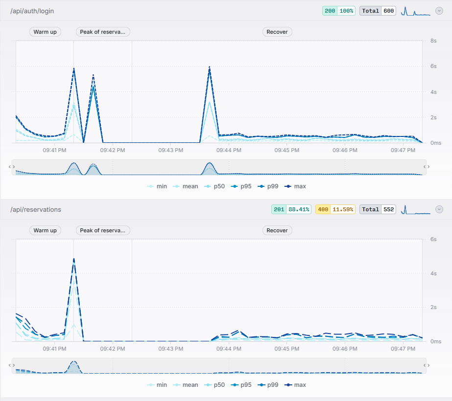
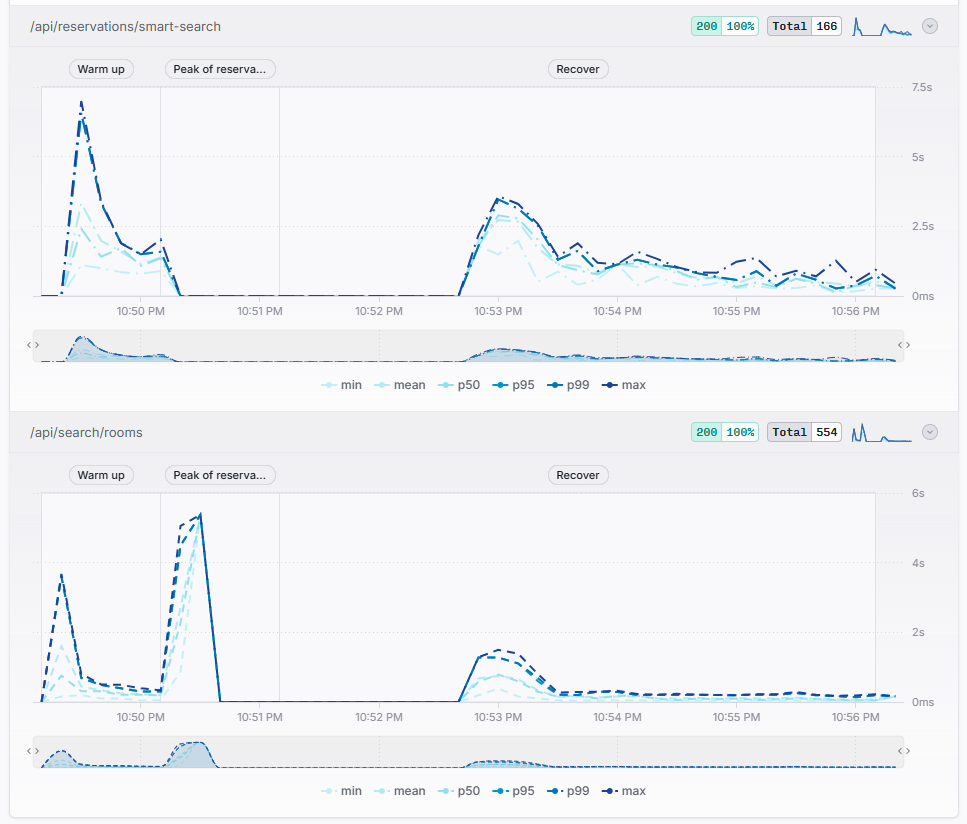

Todos estos resultados mencionados muestran que la aplicación en su estado actual no es capaz de manejar grandes picos de trafico repentinos siendo capaz, como se vio en la prueba de resistencia de esta fase, de manejarlos si son sostenidos y mantenidos en el tiempo. 

---

### Fase 3(load-test-phase-3-**linear**): Prueba de **Rampa Progresiva** en entorno AWS con un balanceador de carga

El objetivo de esta prueba fue mostrar como la aplicación escala ante una demanda creciente de usuarios. Para ello se usaron los mismos endpoints que para las pruebas de resistencia y de estrés:

- **Perfil de Consulta Pura (70% de la carga):** Usuarios que acceden a la plataforma para listar y filtrar espacios universitarios (`/api/search/rooms`), simulando un comportamiento pasivo.
- **Perfil de Reserva Directa (20% de la carga):** Usuarios activos que efectúan consultas y proceden a intentar registrar de forma inmediata una reserva fija (`/api/reservations`).
- **Perfil de Búsqueda Inteligente (10% de la carga):** Usuarios que invocan de manera intensiva el algoritmo avanzado de sugerencias alternativas y disponibilidad temporal (`/api/reservations/smart-search`).

#### Configuración de la prueba:
La prueba se estructuró en 4 fases siendo la primera de 1 minuto con 2 UV/seg, seguida de una fase de 5 minutos con una subida de 2 UV/seg a 5 UV/seg, otra fase de 5 minutos a 7 UV/seg buscando ver como escala un poco mas y estabiliza el numero de réplicas necesarias y finalizando con una fase de otros 5 minutos a 2 UV/seg para ver como se termina de estabilizar las réplicas existentes incluso comienza a retirar réplicas que no son necesarias.

Se programo que ante un uso igual o superior al 60% de CPU se crearan nuevas réplicas de la aplicación para solventar este consumo. Las réplicas tardaron al rededor de 40 segundos en ponerse operativas, pidiendo una señal de vida de estas cada 50 segundos y retirandolas pasados 240 segundos de no recibir señal de estas mismas.

#### Resultados de ejecución de la primera prueba:
- **Completados con éxito lógico:** 49,04% de los usuarios virtuales completaron sus flujos de navegación completos. El resto de usuarios o bien por sobrepasar el tiempo máximo programado en las peticiones, o bien por fallo de las propias réplicas al escalar (debido a la falta de CPU y recursos en algunos momentos de la ejecución) recibieron errores HTTP 500 por ETIMEDOUT (time out).
- **Rendimiento por Endpoint:**
  - `/api/auth/login`, `/api/search/rooms`, `/api/reservations/smart-search` y `/api/reservations`: recibieron un 100% de respuestas exitosas (HTTP 200 y 201). Confirmando de esta forma que las peticiones que no se salieron del tiempo de espera fueron todas  exitosas. 

  - **Tiempos de respuesta (Latencia):** La mediana (p50) estuvo en torno a los 215ms y media de 975 ms, esto junto con el p95 de 5,1 segundos y el p99 de 5,8 segundos muestra que la aplicación dio un servicio medianamente rápido a la mayoria de peticiones que no sobrepasaron los 6 segundos de time out. 

#### Captura de pantalla de Artillery Cloud de la prueba de pico de tráfico de esta fase:

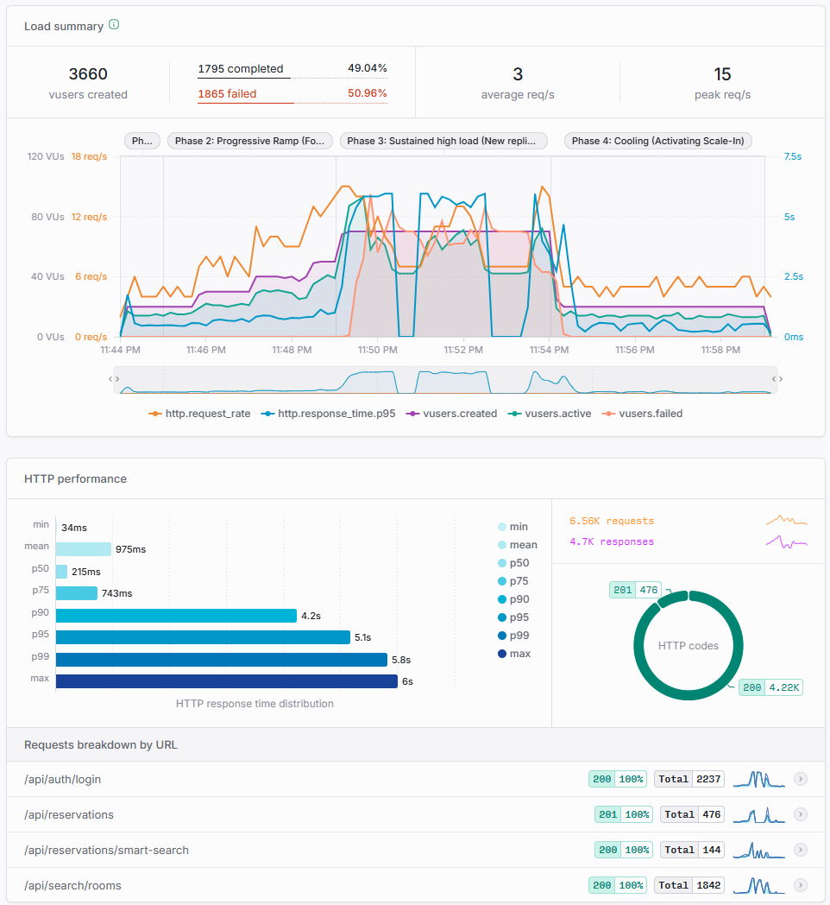
[Enlace al reporte completo en Artillery Cloud](https://app.artillery.io/opmgtbvasi7hy/load-tests/tfwg5_n5gbk48dm3x7tn9zddzhzmmmydz7p_xx9x)

#### Capturas de pantalla de Amazon ECS Y CloudWatch de la prueba de pico de tráfico de esta fase:
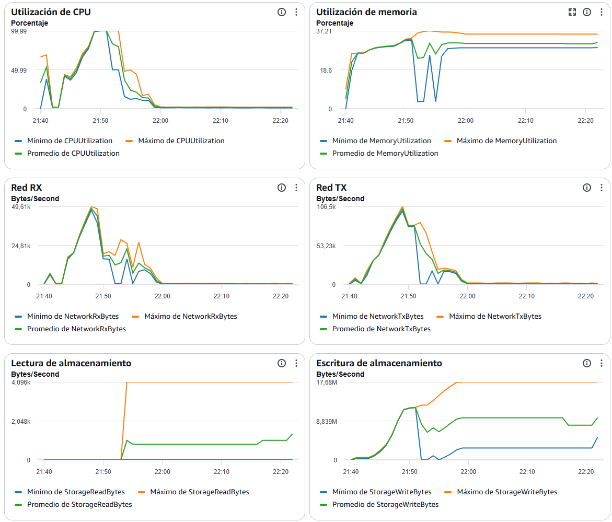
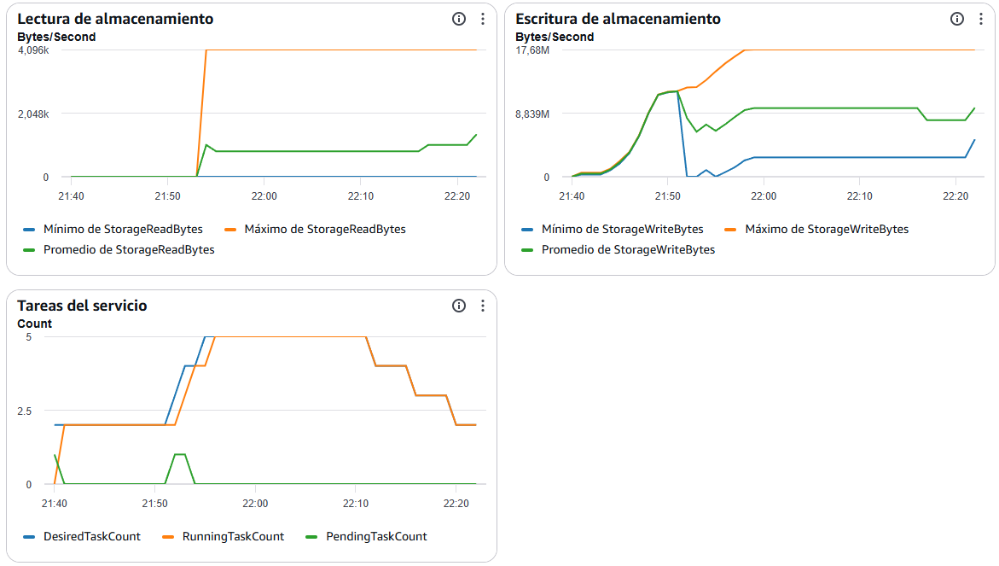
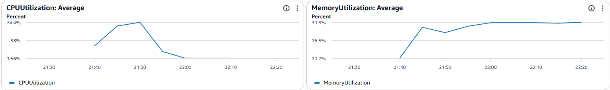

#### Conclusiones de la prueba de rampa progresiva:
Como se puede ver en los graficos presentados sobre esta prueba, concretamente en el grafico de tareas del servicio ECS que les vuelvo a dejar por aquí:
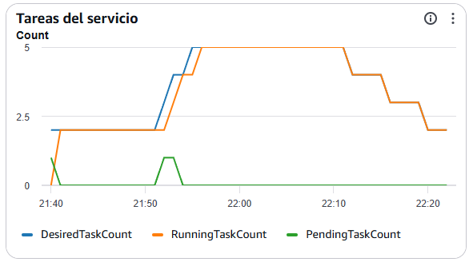

La aplicación ante la demanda creciente de usuarios escalo exactamente como se esperaba que hiciera. Si nos fijamos en la linea azul de este grafico `DesiredTaskCount`(muestra las instancias deseadas en ese momento para que la aplición pueda soportar la carga adecuadamente) y en la linea naranja `RunningTaskCount` (las instancias que actualmente estan activas de la aplicación) podemos ver que en cuanto la aplicación necesita de nuevas instancias, al poco tiempo, pone estas instancias en pendientes para crear e iniciar (`PendingTaskCount` linea verde del gráfico) y estas terminan iniciandose e incorporandose junto con las demas instancias, en los 40/50 segundos que ya mecionamos que tarda la aplicación en activar nuevas réplicas y ponerlas operativas.
Ademas en este gráfico también podemos ver que una vez pasa la carga y baja a una carga más sostenida o directamente termina la carga, la aplicación escala a menos réplicas puesto que para la demanda actual ya no las necesita. Se puede ver como este escalado que baja a menos réplicas se va dando progresivamente, perdiendo de una en una las réplicas hasta volver a quedarse con el mínimo estipulado en la plantilla que usamos para crear el servicio, de 2 réplicas activas.

También si comparamos esta gráficas de tareas pendientes con la de uso de CPU del cluster ECS podemoas apreciar como el uso de CPU sube drasticamente segun las réplicas se van creando y comienza a bajar segun las réplicas ya estan operativas para absorver esa carga.

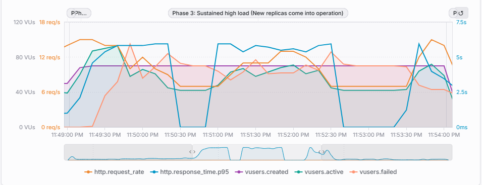

Además se puede ver en la gráfica del test de artillery (mostrada agrandada a continuación) como la aplicación trato de sostener el servicio para la fase de 7 UV/seg de la prueba y como esta es que muestra dos picos descendentes en los tiempos de respuesta de p95 asi como seguido de estos picos descendentes otros ascendentes de los usuarios fallidos. Aunque desde el inicio de esta fase 3 de la prueba los usuarios fallidos eran más que al final de esta fase a pesar de tener estos picos mencionados. Todo esto mencionado coincide con los picos de la gráfica que muestra la creación de réplicas demostrando que ante la creación y activación de nuevas réplicas la aplicación tiene unos breves momentos donde le es más difícil dar el servicio pero despues de estos momentos tras tener una replica más activa el servicio mejora en cierta medida. Comenzamos esta fase 3 con unos 95 usuarios fallidos en uno de los picos y se acaba con 69 usuarios fallidos en el último pico mostrando cierta mejoria tras la incorporación de nuevas réplicas.  

También veo necesario añadir en esta prueba las imagenes de como han ido creandose instancias a lo largo de esta prueba.

Captura en el punto de mayor estrés:
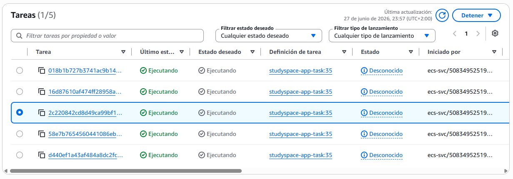
Captura posterior a la prueba pasado un tiempo:
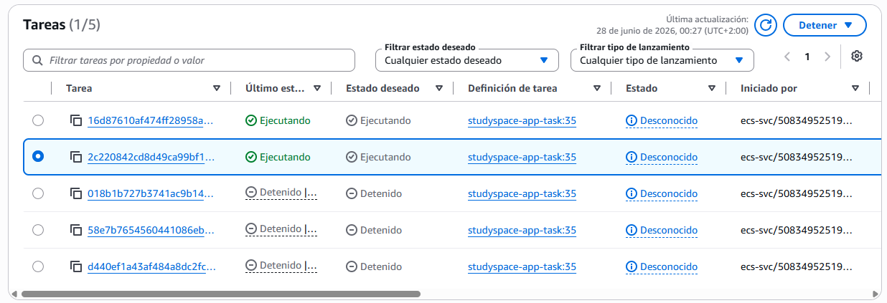

Todos estos resultados mencionados muestran que mientras la aplicación escala esta pierde capacidad para abastecer las peticiones, pero una vez que tiene las instancias funcionando logra soportar mejor estos picos de carga. 

