## Documentación de pruebas de carga y concurrencia

El objetivo de estas pruebas es validar el rendimiento de la aplicación bajo estrés, evaluar la correcta distribución del tráfico mediante el balanceador de carga (HAProxy) y confirmar que las políticas de concurrencia de reservas operan correctamente sin permitir solapamientos.

### Entorno de pruebas (hardware y software)

Las pruebas que se han ejecutado en un entorno local en una máquina con las siguientes especificaciones:

#### Especificaciones de hardware (máquina local):

##### Fases 0 y 1

Estas pruebas se llevaron a cabo en mi ordenador local con estas especificaciones:

- Sistema Operativo: [ Windows 10 Home (Versión 22H2, arquitectura de 64 bits) ]

- Procesador (CPU): [Intel(R) Core(TM) i7-1065G7 CPU @ 1.30GHz - 1.50 GHz. Cuenta con 4 núcleos físicos y 8 procesadores lógicos.]

- Memoria RAM: [ 8 GB ]

- Almacenamiento: [238 GB SSD ]

##### Fase 2  
En esta fase se desplegó la infraestructura en Amazon Web Services (AWS) mediante una plantilla de CloudFormation, utilizando recursos limitados correspondientes a la capa gratuita para establecer un entorno de pruebas controlado y de bajo coste:

- **Instancia EC2 (Servidor de Aplicaciones):** instancia `t3.micro` (2 vCPU, 1 GB de memoria RAM), ejecutando una única instancia contenerizada de la aplicación mediante Docker, sin réplicas ni políticas de auto-escalado activas.

- **Base de Datos RDS (Persistencia Relacional):** 1x instancia de base de datos `db.t3.micro` ejecutando MySQL 8.0 (2 vCPU, 1 GB de memoria RAM y 20GiB de Almacenamiento), configurada de forma aislada e independiente del servidor de aplicaciones.

- **Almacenamiento S3:** Un bucket de AWS S3 para la persistencia y distribución de imágenes asociadas a los espacios universitarios y fotos de perfil de los usuarios, sustituyendo el almacenamiento local basado en MinIO de las fases previas.

#### Especificaciones de software:

##### Fases 0 y 1

- Docker Desktop v4.29.0 configurado con el backend de WSL 2 (Windows Subsystem for Linux).
  Debido a esta configuración, los límites de recursos (CPU, memoria RAM, ...) no son estáticos, sino que son gestionados y asignados dinámicamente por el propio sistema operativo Windows según la demanda de los contenedores.

- 1 Balanceador de carga HAProxy (v2.8).

- 3 Réplicas de la aplicación.

- 1 Contenedor MySQL (v8.0).

- 1 Contenedor MinIO. (latest)

##### Fase 2

- 1 única instancia docker con la aplicación contenedorizada (EC2).

- 1 única instancia de base de datos (RDS).

- 1 única instancia de almacenamiento de ficheros (Bucket S3).

### Instrucciones de Ejecución

Para ejecutar las pruebas de carga, se han seguido los pasos descritos al final del archivo [**executionInstructions.md**](docs/executionInstructions.md)

### Herramienta y Escenario de Prueba

Se ha utilizado Artillery en local conectado a Artillery Cloud para la captura y visualización de telemetría.
El escenario simulado por cada Usuario Virtual (UV) replica el comportamiento real dentro de la aplicación de un usuario registrado
ya que se espera sean de estos la gran mayoria de la demanda de la aplicacióón. El flujo de acciones de los UV es el siguiente:

Petición POST a /api/auth/login para autenticación.

Petición GET a /api/auth/me para obtener datos de sesión.

Petición GET a /api/rooms para listar espacios disponibles.

Petición POST a /api/reservations para reservar una sala, se han programado varias peticiones compitiendo por la misma sala (roomId: 1) y en la misma franja horaria para comprobar la respuesta concurrente de la aplicación ante el estrés.

Petición POST a /api/auth/logout para cerrar la sesión.

### Fase 0(load-test-phase-0): Prueba de concurrencia local (sin balanceador de carga)

Esta prueba establece una línea base atacando directamente a una única instancia del backend desplegada en local (http://127.0.0.1:8080/).

- Configuración de carga: 10 usuarios/segundo durante 5 segundos (Total: 50 Usuarios).

- Resultados Esperados: El sistema debe gestionar el bloqueo a nivel de base de datos. De las 50 peticiones concurrentes para reservar la misma sala, se espera obtener exactamente un código HTTP 201 (reserva exitosa) y 49 códigos HTTP 400 (rechazo por concurrencia), demostrando que el bloqueo de la base de datos funciona como se espera.

- Resultados de ejecución:
  - Completados: 50 UVs (100% de éxito en ejecución).
  - Tiempos de respuesta: Mediana (p50) de 109ms y un p95 de 433ms.

  - Validación de Concurrencia: De las 50 peticiones concurrentes para reservar la misma sala, se obtuvo exactamente un código HTTP 201 y 49 códigos HTTP 400, demostrando que el bloqueo de la base de datos funciona como se espera.

  - Captura de pantalla de Artillery Cloud de este test:

    
    [Enlace al reporte completo en PDF](artillery_reports/artillery-test-0.pdf)

- Conclusiones de la prueba: La aplicación maneja correctamente la concurrencia a nivel de base de datos, permitiendo solo una reserva exitosa y rechazando las demás. Sin embargo, el tiempo de respuesta p95 de 433ms indica que bajo esta carga, la aplicación puede experimentar cierta latencia, lo que sugiere que la arquitectura monolítica sin balanceo de carga puede no ser óptima para manejar cargas más altas.

### Fase 1A(load-test-phase-1): Prueba de carga y concurrencia local sostenida en arquitectura distribuida (con balanceador de carga)

Esta prueba evalúa la aplicación contenerizada completa (el docker-compose-dev.yml para desarrollo), atacando al balanceador de carga HAProxy (https://localhost/api) que funciona con un Round Robin gestionando las 3 replicas de la aplicación.

- Configuración de carga:
  - Fase de calentamiento (Warm up): 15 segundos a 2 UVs/seg.

  - Fase de carga sostenida: 30 segundos a 3 UVs/seg(se tuvo que bajar de 5UV/seg a 3UV/seg debido a que si no la CPU no daba a basto a tantas peticiones y algunas fallarian por ETIMEDOUT, y aun a pesar de este ajuste solo los test iniciales que se realizan estan libres de ETIMEDOUT por lo que esta es la cifra limite de aforo para la aplicación en local).

  - Total generado: 120 Usuarios.

- Algoritmo de Balanceo: Dynamic Round Robin.

- Resultados Esperados: El sistema debe distribuir la carga entre las 3 réplicas del backend, manteniendo tiempos de respuesta razonables. De las 120 peticiones concurrentes para reservar la misma sala, se espera obtener exactamente un código HTTP 201 (reserva exitosa) y 119 códigos HTTP 400 (rechazo por concurrencia), demostrando que el bloqueo de la base de datos sigue funcionando correctamente incluso bajo una carga más alta y distribuida.

- Resultados de ejecución:
  - Completados: 118 UVs completados con éxito. Hubo 2 fallos menores por ETIMEDOUT (1.67%), algo esperado al saturar la red interna de Docker en localhost y no disponer de más recursos para estos 2 usuarios mostrando que el umbral tolerable para mi aplicación esta en 3 usuarios por segundo ya que pruebas más alla de eso generan muchos más usuarios con errores ETIMEDOUT y con 3 usuarios por segundo el primer test que se corre de artillery es capaz de pasar completamente limpio y al segundo ya comienzan a aparecer errores de ETIMEDOUT.
  - Tiempos de respuesta: Mediana (p50) de 34ms y un p95 de 105ms.

  - Captura de pantalla de Artillery Cloud de este test:

    
    [Enlace al reporte completo en PDF](artillery_reports/artillery-test-1A-primero.pdf)

  - Captura de pantalla de Artillery Cloud de este test con mas usuarios por segundo para mostrar la diferencia y el aforo limite de la aplicación en local para este test:

    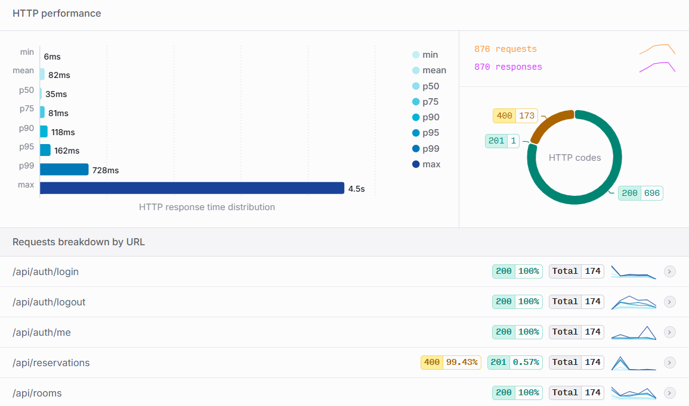
    [Enlace al reporte completo en PDF](artillery_reports/artillery-test-1A-segundo.pdf)

- Conclusiones de la prueba: A pesar de inyectar más del doble de usuarios virtuales que en la Fase 0, la arquitectura distribuida redujo el tiempo de respuesta p95 de 433ms a 162ms. Nuevamente, la regla de concurrencia se mantuvo sólida: 1 única reserva exitosa (HTTP 201) y 117 rechazos controlados (HTTP 400).

### Fase 1B(load-test-phase-1-heavy): Prueba de carga de procesamiento intensivo en entorno local

Tras validar la concurrencia y el limite de usuarios por segundo en local en mi máquina en la prueba anterior(1A), esta prueba busca estresar la CPU y la base de datos mediante endpoints que requieren cálculos complejos, búsquedas avanzadas y agregaciones de datos.
Con el fin de evaluar el rendimiento de la arquitectura ante lógica de negocio costosa aprovechando propiedades de la aplicación como:

- Hibernate Search: Búsquedas difusas (fuzzy search) y full-text.

- Cálculos geográficos: Uso de la fórmula de Haversine para distancias entre campus.

- Generación de mapas de calor: Procesamiento iterativo de calendarios y disponibilidad.

- Estadísticas dinámicas: Agregaciones en tiempo real de la ocupación.

- Configuración de carga:
  - Fase de calentamiento: 15 segundos a 2 UV/seg.

  - Fase de carga sostenida: 30 segundos a 2 UV/seg(se tuvo que bajar de 3UV/seg a 2UV/seg debido a que si no la CPU no daba a basto a tantas peticiones).

  - Total generado: 90 Usuarios (flujo completo de 6 peticiones pesadas por usuario).

- Algoritmo de Balanceo: Dynamic Round Robin.

- Resultados Esperados: El sistema debe gestionar la carga de procesamiento intensivo sin degradar significativamente los tiempos de respuesta. Se espera que el sistema mantenga,aunque sean superiores, unos tiempos de respuesta razonables no muy distantes a los obtenidos en la prueba 1A, demostrando que la arquitectura puede manejar operaciones complejas incluso bajo carga.

- Resultados de ejecución:
  - Completados: 90 UVs (100% de éxito).

  - Tiempos de respuesta: Mediana (p50) de 34ms y un p95 de 116ms. A pesar de la complejidad de los cálculos (Smart Search y Calendar), la distribución en 3 réplicas permite mantener latencias por debajo de los 100ms para el 95% de los usuarios.

  - Captura de pantalla de Artillery Cloud de este test:

    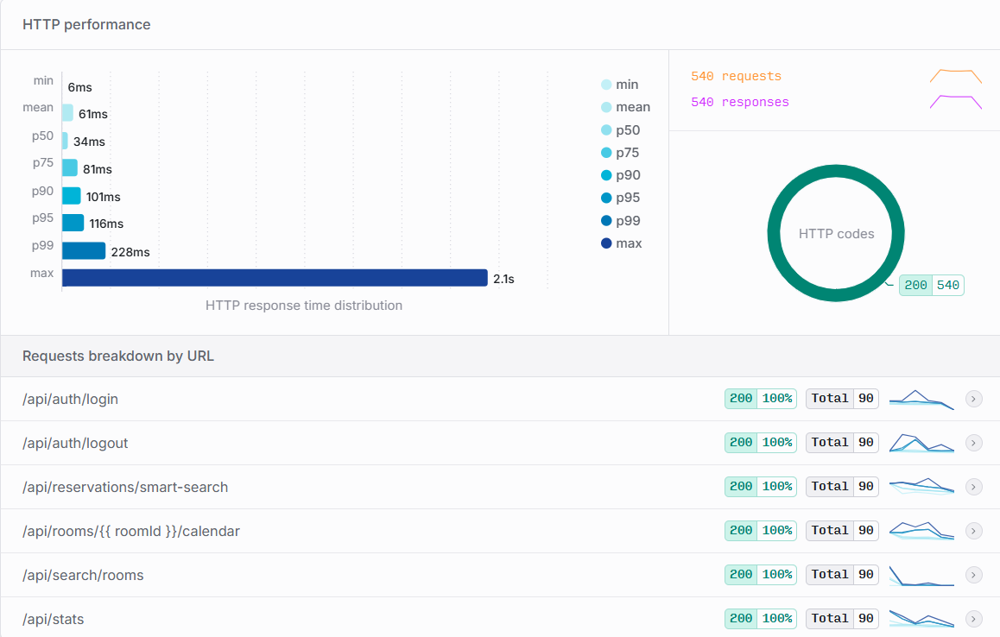
    [Enlace al reporte completo en PDF](artillery_reports/artillery-test-1B.pdf)

Conclusiones de la prueba: La aplicación demuestra una alta capacidad de cómputo en local manteniendo unos tiempos de respuesta razonables para los procesos que se le piden, a pesar de las limitaciones del hardware sobre el que se ejecutan las pruebas, ante consultas bastante estresantes debido a la cantidad de computo que llevan.

### Fase 2A(load-test-phase-2-stress): Prueba de Esfuerzo y Límite en entorno AWS con una replica

El objetivo de esta prueba fue estresar la capacidad de procesamiento de la infraestructura en la nube bajo un escenario que simula el comportamiento de picos de demanda. Se buscó forzar los endpoints críticos del backend mediante tres perfiles de usuarios simulados:

- **Perfil de Consulta Pura (70% de la carga):** Usuarios que acceden a la plataforma para listar y filtrar espacios universitarios (`/api/search/rooms`), simulando un comportamiento pasivo.
- **Perfil de Reserva Directa (20% de la carga):** Usuarios activos que efectúan consultas y proceden a intentar registrar de forma inmediata una reserva fija (`/api/reservations`).
- **Perfil de Búsqueda Inteligente (10% de la carga):** Usuarios que invocan de manera intensiva el algoritmo avanzado de sugerencias alternativas y disponibilidad temporal (`/api/reservations/smart-search`).

#### Configuración de la carga:
La primera prueba se estructuró en cuatro fases progresivas de inyección en Artillery: 
una fase de calentamiento a 2 UV/seg durante 60 segundos, seguida de una rampa agresiva incrementando hasta 10 UV/seg durante 120 segundos, aproximándose al límite teórico entre 10 y 12 UV/seg en los siguientes 120 segundos, y finalizando con un pico sostenido de 12 UV/seg durante 120 segundos adicionales.

La segunda prueba se estructuró también en cuatro fases progresivas: 
las 2 primeras fases fueron iguales a las del test anterior después seguimos entre 10 y 15 UV/seg en los siguientes 120 segundos, y finalizamos con un pico sostenido de 17 UV/seg durante 120 segundos adicionales.

#### Resultados de ejecución de la primera prueba:
- **Completados con éxito lógico:** 100% de los usuarios virtuales completaron sus flujos de navegación sin provocar caídas del servicio de aplicaciones o interrupciones críticas del contenedor (cero errores HTTP 500).
- **Rendimiento por Endpoint:**
  - `/api/auth/login`, `/api/search/rooms` y `/api/reservations/smart-search`: 100% de respuestas exitosas (HTTP 200). La infraestructura absorbió eficientemente las búsquedas de texto plano indexadas con Apache Lucene / Hibernate Search.
  - `/api/reservations`: Se registro un 0,37% (4 respuestas del total mandado a este endpoint) de las respuestas como **HTTP 400 Bad Request** debido a la generación aleatoria de reservas que alguna coincidencia accidental genera, frente a las 1065 (99,63%) confirmaciones exitosas con código **HTTP 201 Created**.
  - **Tiempos de respuesta (Latencia):** Mientras que las lecturas mantuvieron una mediana (p50) baja y estable en torno a los 133ms y media de 190ms, los intentos de escrituras concurrentes provocaron picos de degradación en los percentiles más altos, alcanzando un p95 de 478ms y un p99 de 983 ms.

#### Captura de pantalla de Artillery Cloud de la primera prueba:

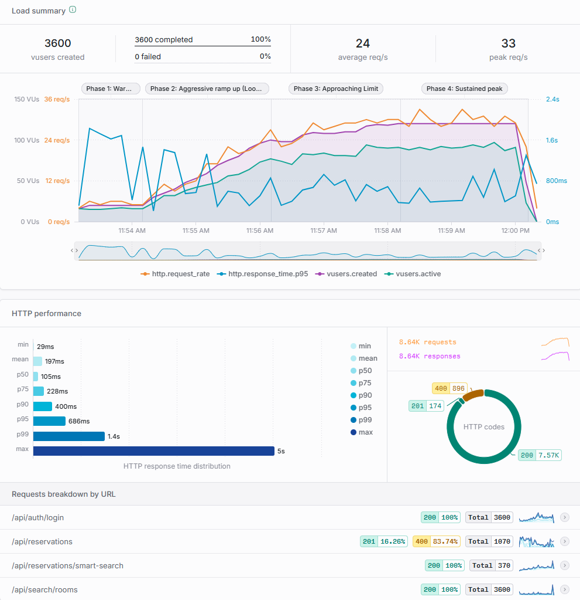
[Enlace al reporte completo en Artillery Cloud](https://app.artillery.io/opmgtbvasi7hy/load-tests/tcgay_x4yjnawbjrekhhebmx3x7eznmeyxr_ch6t)

#### Conclusiones de la primera prueba de esfuerzo:
En la gráfica se pueden apreciar ciertos picos al inicio de cada fase de este test cuando los usuarios subian drasticamente. A partir de los 10 usuarios en adelante al finalizar la fase 2 estos picos se volvieron más y más pronunciados en cuanto al tiempo máximo de espera de p95 de la aplicación. 
Si nos fijamos en la linea naranja, verde  y azul veremos que justo cuando la aplicación presenciaba una caida en la demanda de peticiones y un pico en los usuarios activos en la aplicación justo en ese momento los tiempos de respuesta se disparaban puesto que la aplicación no pudo procesar tan rápido ese aumento en los usuarios activos. 
Esto nos muestra que nuestra aplicación cuando esta rondando los 90 usuarios activos aproximadamente (dentro de las limitaciones que ofrece una replica en la capa gratuita de AWS) permanece con unos tiempos de respuesta bajos acordes al número de peticiones que llegan, pero cuando estos usuarios activos suben por encima de los 90, la aplicación comienza a no dar a basto para atender todas las peticiones y comienza a ponerlas en cola, lo que genera que se disparen los tiempos de respuesta. Aun asi en este test se puede apreciar que los 3600 usuarios generados pudieron completar con éxito sus cometidos (salvo esos 4 errores 400 debidos a unas reservas que no cumplian con las reglas de negocio de la aplicación debido la generación aleatoria de estas para lograr abastecer más de 1000 solicitudes de reserva).

Esto muestra que la aplicación soporta flujos de hasta 12 usuarios nuevos siendo solo 1 sola réplica, aunque la velocidad de la repuesta se deteriore a partir de 10 usuarios nuevos.

#### Resultados de ejecución de la segunda prueba:
- **Completados con éxito lógico:** 63,38%% de los usuarios virtuales completaron sus flujos de navegación sin provocar errores HTTP 500. En cambio un 36,62% de los usuarios sufrieron de estos errores 500 debido al tiempo de espera que estuvieron en la cola por la saturación de esta prueba frente a la anterior.
- **Rendimiento por Endpoint:**
  - `/api/auth/login`, `/api/search/rooms` y `/api/reservations/smart-search`: 100% de respuestas exitosas (HTTP 200).
  - `/api/reservations`: Se registro un 0,16% (1 respuesta del total mandado a este endpoint) de las respuestas como **HTTP 400 Bad Request** debido a la generación aleatoria de reservas que alguna coincidencia accidental genera, frente a las 628 (99,84%) confirmaciones exitosas.
  - **Tiempos de respuesta (Latencia):** La mediana (p50) subio hasta los 268ms (más del doble que en la prueba anterior), la media también subio bastante de los 190ms hasta los 1,3 segundos(más de 6 veces el tiempo anterior). Los intentos de escrituras también aumentaron bastante en tiempo alcanzando un p95 de 6,9 segundos y un p99 de 7,8segundos. Siendo la peor respuesta de 8 segundos puesto que mas alla de este tiempo la aplicación no respondio a las peticiones.

#### Captura de pantalla de Artillery Cloud de la segunda prueba:

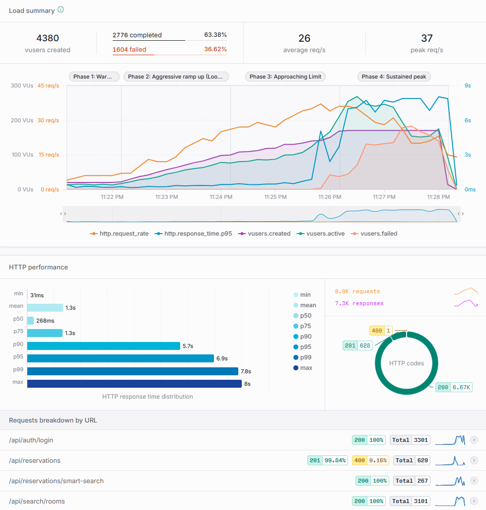
[Enlace al reporte completo en Artillery Cloud](https://app.artillery.io/opmgtbvasi7hy/load-tests/tebjh_y6g9gaw5e6ejd4cjyq7pjy9kpn639_bh8b)

#### Conclusiones de la segunda prueba de esfuerzo:
Al mantenerse igual las 2 primeras fases la grafica genera resultados similares en estas. No es hasta la 3 fase que vemos cambios significativos donde podemos apreciar que los usuarios comienzan a fallar en cuanto las respuestas p95 comienzan a tardar mas debido al exceso de usuarios activos en la aplicación. Como podemos comprobar antes de fallar los usuarios activos en la aplicación rondan los 100 usuarios (120 en el momento antes de comenzar a perder peticiones por no dar a basto) como mencionamos en las conclusiones del test anterior con unos 90 usuarios activos a la vez pudimos ver que la aplicación comenzaba a tardar bastante tiempo pero lograba reponderlos a todos. Sin embargo aquí con 100 usuarios activos simultaneamente vemos que la aplicación comienza a fallar. 

#### Conclusiones generales de las pruebas de esfuerzo:
Estos dos test nos muestran que el cuello de botella de la aplicación se encuentra entre los 90 y 100 usuarios activos y entre los 12 y 15 usuarios generados por segundo, más alla de este límite (para la versión gratuita de AWS y una sola replica disponible) la aplicación no es capaz de abastecer a todas las peticiones pendientes. 
También nos muestran estos resultados que el endpoint más crítico de la aplicación (debido a las comprobaciones que se lleban a cabo antes de completar una reserva asi como el  bloqueo de la base de datos para evitar reservas duplicadas en diferentes usuarios) es el endpoint de /api/reservations/ aunque el endpoint más lento sea api/reservations/smart-search debido a que sus tiempos son parejos a los de las reservas pero muchos menos usuarios estaban atacando este endpoint.
Después de estos 2 endpoints el más rápido en base a los test realizados seria la barra de busqueda de aulas mediante api/search/rooms y el segundo más rápido el propio inicio de sesión de la página web en /api/auth/login. Estos endpoints, a diferencia de los anteriores que recibian menor carga de usuarios para simular un comportamiento real de la aplicación, recibieron el 100% de los usuarios, todos pasaron por ellos.
Estas son las capturas de la primera prueba de estres (aunque para esta conclusión se han comparado los resultados de más pruebas para asegurarse):

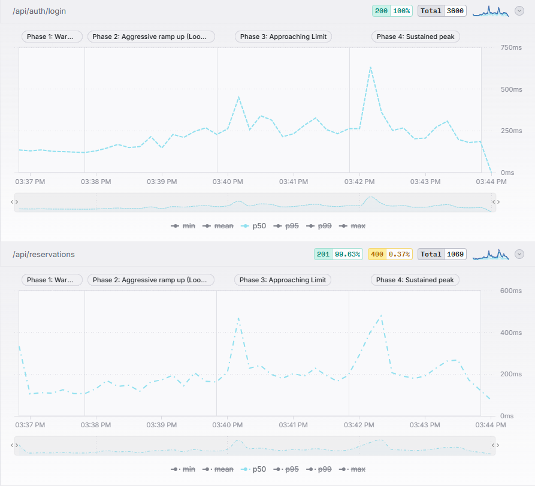
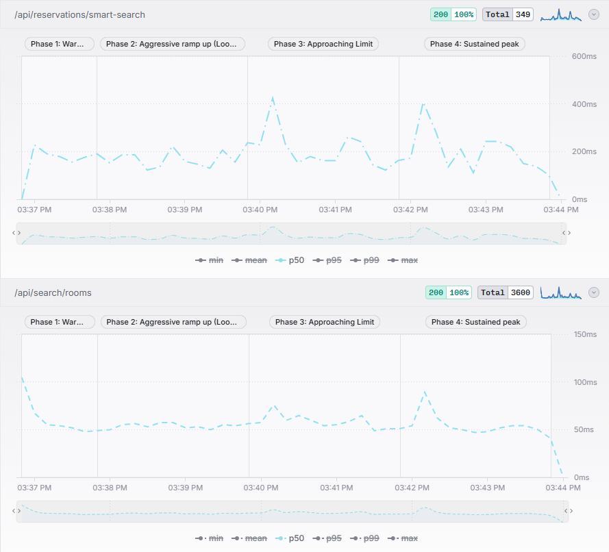

---

### Fase 2B (load-test-phase-2-soak): Prueba de Resistencia y Estabilidad Sostenida (Soak Test) en entorno AWS (Solo una réplica)

El propósito de esta fase fue someter a la instancia única de AWS a una carga continua de usuarios virtuales con el fin de evaluar la fatiga del sistema a lo largo del tiempo, vigilando el comportamiento del recolector de basura de la JVM (*Garbage Collector*), el uso sostenido del pool de conexiones de base de datos HikariCP y la posible presencia de fugas de memoria (*Memory Leaks*). Los endpoints atacados en esta prueba seran excatamente los mismos que se expusieron en la prueba anterior (Fase 2A(load-test-phase-2-stress)).

#### Limitación del plan gratuito de la herramienta Artillery Cloud:
Debido a las políticas comerciales implementadas en la plataforma de Artillery, la visualización y captura de telemetría a través de su servicio en la nube (*Artillery Cloud*) se encuentra restringida a un máximo estricto de 30 minutos de duración en su plan gratuito. Dado que una prueba de resistencia requiere analizar el comportamiento persistente del sistema operativo y de los contenedores más allá de dicho umbral temporal, se optó por una estrategia diferente. 

Se configuró Artillery para volcar todas las métricas e intervalos de telemetría del test en formato `.json`. Posteriormente, se diseñó e implementó un script automatizado en Python que procesa dicho JSON de forma local. Este script extrae de forma secuencial las métricas agregadas por periodos e implementa un generador de gráficos, garantizando graficas con el sufiente detalle como para suplir las de *Artillery Cloud*.

#### Configuración de la carga:
La primera prueba se estructuró en dos fases: 
una fase de calentamiento a 2 UV/seg durante 60 segundos, seguida de una fase sostenida de 5 UV/seg durante las dos siguientes horas.

La segunda prueba se estructuró en dos fases: 
una fase de calentamiento a 2 UV/seg durante 60 segundos, seguida de una fase sostenida de 2 UV/seg durante las dos siguientes horas. Esto con el fin de mostrar una diferencia con una carga sostenida más leve que en la prueba anterior.

#### Resultados de ejecución de la primera prueba:
- **Volumen Total:** Se procesó un flujo masivo de 36,080 usuarios virtuales creados, que intentaron generar 63,373 peticiones HTTP. De estas, el servidor logró responder a 54,366, perdiéndose el resto debido a la asfixia del hardware de AWS tras superar su límite operativo.
- **Códigos de Estado y Errores de Flujo:**
  - Respuestas exitosas de sesión y lectura (HTTP 200): 51,615 peticiones.
  - Reservas confirmadas (HTTP 201): 2,745 peticiones.
  - Rechazos por reglas de negocio (HTTP 400): 0 peticiones.
  - Timeouts de red (ETIMEDOUT): 8,999 peticiones cortadas por la herramienta al tardar demasiado en responder.
  - Usuarios abortados por Artillery (vusers.failed): 14,515 usuarios virtuales que no pudieron terminar su flujo por culpa de los cortes de conexión. 
- **Estudio de Tiempos de Respuesta Sostenidos:** Al analizar las peticiones que lograron completarse exitosamente antes y durante el estrangulamiento del hardware, el sistema arrojó una **media global de 199.8 ms** y una **mediana (p50) de 172.5 ms**. La degradación por la falta de CPU se hizo evidente en los percentiles superiores, estabilizándose tanto el **p95 como el p99 en 262.5 ms**. Es fundamental destacar que estas métricas representan únicamente el subconjunto de peticiones que "sobrevivieron" y lograron ser procesadas; la verdadera penalización del rendimiento en esta prueba no se reflejó en una latencia extrema, sino en los casi 9,000 *timeouts* de red de peticiones que se quedaron encoladas sin llegar a resolverse.

#### Captura de las gráficas de la primera prueba procesadas localmente mediante el script en Python:

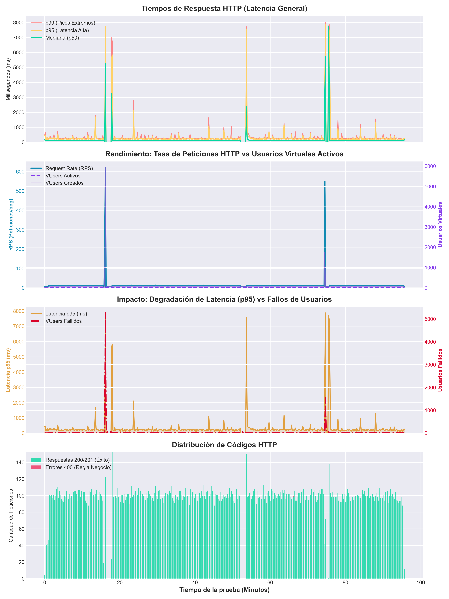
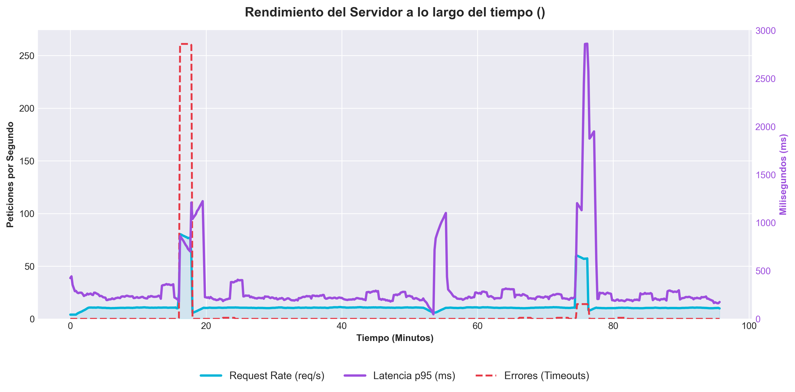
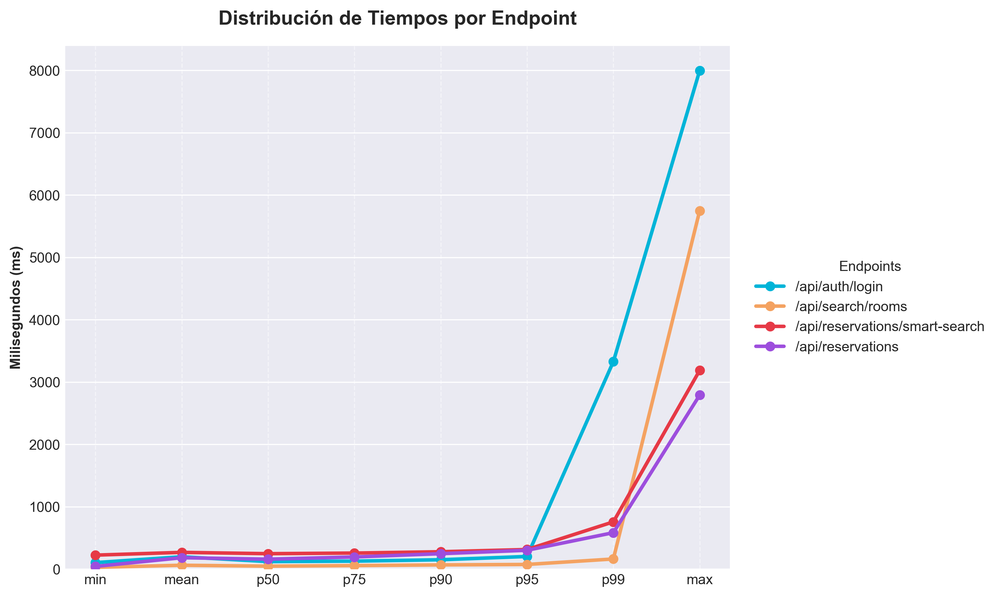

#### Conclusiones de la primera prueba de resistencia (Soak Test):
Esta prueba evidenció el límite exacto de la instancia t3.micro de AWS. Sostener 5 usuarios nuevos por segundo de manera ininterrumpida devoró los recursos de la máquina en los primeros minutos. Al agotarse, AWS estranguló el procesamiento al 20%, lo que generó un cese del servicio en esos picos que se ven en las graficas. Esto resulto en 8,999 peticiones perdidas por TIMEOUT mostrando que la instancia micro no puede sostener esta densidad de tráfico perpetuo, aunque el software en sí demostró no corromperse (0 errores HTTP 500).

#### Resultados de ejecución de la segunda prueba:
- **Volumen Total:** Se procesó un flujo de 14,520 usuarios virtuales creados, que generaron 28,979 peticiones HTTP. En esta ocasión, el 100% de las peticiones de red fueron procesadas y respondidas con éxito, logrando un flujo sin interrupciones a nivel de servidor.
- **Códigos de Estado y Errores de Flujo:**
  - Respuestas exitosas de sesión y lectura (HTTP 200): 27,524 peticiones.
  - Reservas confirmadas (HTTP 201): 1.453 peticiones.
  - Rechazos por reglas de negocio (HTTP 400):2 peticiones.
  - Timeouts de red (ETIMEDOUT): 0 peticiones.
  - Usuarios abortados por Artillery (vusers.failed): 2.971 usuarios virtuales. Tras auditar la telemetría, se constata que estos fallos no reflejan una caída ni una saturación del servidor (el backend procesó estas peticiones devolviendo respuestas HTTP 200 OK de forma fluida). El origen de estos abortos reside en un defecto de configuración del propio script de pruebas automatizado para el escenario de "Reserva Directa". La herramienta intentaba extraer un parámetro de la respuesta mediante una instrucción capture, pero debido a un desfase o agotamiento en los datos de prueba inyectados durante las 2 horas, el formato de la respuesta no contenía el campo esperado. En consecuencia, Artillery abortó internamente la ejecución de esos usuarios (Failed capture or match).
- **Estudio de Tiempos de Respuesta Sostenidos:** Bajo esta carga adaptada a la capacidad de la instancia, la latencia demostró un comportamiento excepcionalmente robusto y estable. La **mediana global (p50)** se mantuvo plana a lo largo de las dos horas de prueba marcando **125.2 ms**, alineada con una **media global de 141.2 ms**. Las latencias máximas registradas mostraron picos altamente controlados, alcanzando un **p95 de 133.0 ms** y un **p99 de 135.7 ms** en los momentos de mayor concurrencia. Esta mínima desviación estándar entre la mediana (p50) y el percentil 99 (p99) confirma la ausencia de contención en la base de datos y certifica que la infraestructura operó fluidamente.

#### Captura de las gráficas de la segunda prueba procesadas localmente mediante el script en Python:

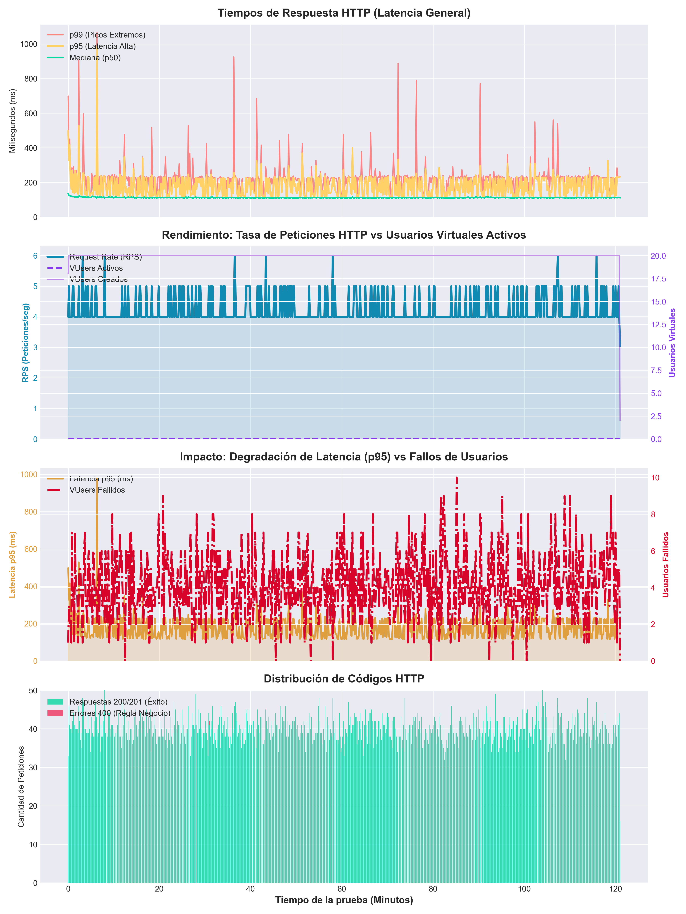
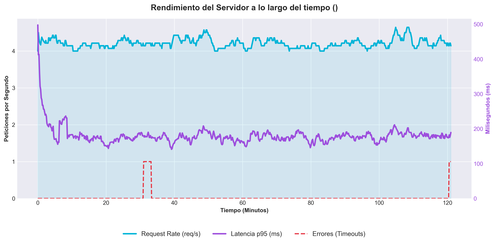
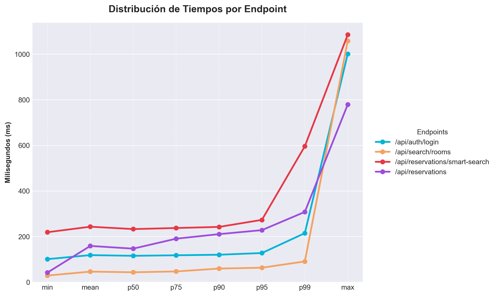

#### Conclusiones de la segunda prueba de resistencia (Soak Test):
Al reducir la carga a 2 UV/s, la instancia logró un equilibrio perfecto entre la CPU consumida y la regeneración de créditos de AWS. El test demostró un éxito absoluto de infraestructura: cero caídas, cero timeouts y latencias estables durante 2 horas seguidas. Demostrando así en que franja de usuarios se encuentra el limite de mi aplicación con una sola replica desplegada en la infraestructura de AWS.

#### Conclusiones generales de las pruebas de resistencia (Soak Test):

El cruce de ambas pruebas de resistencia ha permitido sacar estas conclusiones sobre la estabilidad técnica del sistema desarrollado:

- Ausencia confirmada de Fugas de Memoria (Memory Leaks): En la segunda prueba (2 UV/seg) la línea de latencia se mantuvo absolutamente plana. Si el sistema sufriera una mala gestión de la memoria o acumulara conexiones huérfanas en la base de datos, el tiempo de respuesta habría mostrado una degradación paulatina a lo largo de las 2 horas. La JVM gestionó y limpió con gran eficiencia cada sesión finalizada.

- Dimensionamiento del Hardware en la Nube: Las pruebas han acotado matemáticamente que, para una infraestructura de capa gratuita (t3.micro sin escalado), la velocidad garantizada para operaciones complejas como búsquedas y transacciones con bases de datos relacionales se sitúa en 2 usuarios concurrentes por segundo. Para volúmenes sostenidos mayores, la arquitectura demanda forzosamente escalar la máquina a instancias de mayores prestaciones (escalado vetical) o añadir réplicas manejadas por un balanceador (escalado horizontal).

También sacamos conclusiones de los endpoints, mostrando que de normal se mantiene el orden que comprobamos en la prueba anterior, de tiempo que tarda cada uno. Aunque cuando las peticiones se acumulan los tiempos de espera en estos endpoints más rapidos, en situciones muy especiales(como p95 o p99), pueden dispararse mucho más que las de los endpoints más dificiles de procesar, como pueden ser las reservas o la busqueda inteligente de aulas alternativas a la nuestra.

### Fase 3(load-test-phase-3-stress): Prueba de Esfuerzo y Límite en entorno AWS con un balanceador de carga

El objetivo de esta prueba fue el mismo que el de la prueba de esfuerzo de la fase anterior, estresar la capacidad de procesamiento de la infraestructura en la nube bajo un escenario que simula el comportamiento de picos de demanda. Se buscó forzar los endpoints críticos del backend mediante los mismos tres perfiles de usuarios simulados usados en la fase anterior:

- **Perfil de Consulta Pura (70% de la carga):** Usuarios que acceden a la plataforma para listar y filtrar espacios universitarios (`/api/search/rooms`), simulando un comportamiento pasivo.
- **Perfil de Reserva Directa (20% de la carga):** Usuarios activos que efectúan consultas y proceden a intentar registrar de forma inmediata una reserva fija (`/api/reservations`).
- **Perfil de Búsqueda Inteligente (10% de la carga):** Usuarios que invocan de manera intensiva el algoritmo avanzado de sugerencias alternativas y disponibilidad temporal (`/api/reservations/smart-search`).

#### Configuración de la carga:
La prueba se estructuró en 5 fases progresivas de inyección en Artillery, buscando no colapsar la CPU y la base de datos antes de que se llegaran a implementar algunas de las replicas, para asi poder comprobar como el sistema se adaptaba mediante el balanceador de carga de AWS a la carga de la prueba. Se dividio en las siguinetes fases la prueba:  
una fase de calentamiento a 2 UV/seg durante 60 segundos, seguida de un incremento hasta 8 UV/seg durante 240 segundos(4 minutos), después se sostuvo la carga de 8 UV/seg en los siguientes 180 segundos(3 minutos) con el fin de que se estabilizaran las nuevas replicas para que funcionaran para la carga con mas usuarios, se volvio a aumentar a 12 UV/seg durante otros 240 segundos y se finalizo con una pequeña fase de 120 segundos con una carga de 2 UV/seg para que volviera a un flujo calmado.

#### Resultados de ejecución de la primera prueba:
- **Completados con éxito lógico:** 100% de los usuarios virtuales completaron sus flujos de navegación sin provocar caídas del servicio de aplicaciones o interrupciones críticas del contenedor (cero errores HTTP 500).
- **Rendimiento por Endpoint:**
  - `/api/auth/login`, `/api/search/rooms` y `/api/reservations/smart-search`: 100% de respuestas exitosas (HTTP 200). La infraestructura absorbió eficientemente las búsquedas de texto plano indexadas con Apache Lucene / Hibernate Search.
  - `/api/reservations`: Se registro un 0,37% (4 respuestas del total mandado a este endpoint) de las respuestas como **HTTP 400 Bad Request** debido a la generación aleatoria de reservas que alguna coincidencia accidental genera, frente a las 1065 (99,63%) confirmaciones exitosas con código **HTTP 201 Created**.
  - **Tiempos de respuesta (Latencia):** Mientras que las lecturas mantuvieron una mediana (p50) baja y estable en torno a los 133ms y media de 190ms, los intentos de escrituras concurrentes provocaron picos de degradación en los percentiles más altos, alcanzando un p95 de 478ms y un p99 de 983 ms.

#### Captura de pantalla de Artillery Cloud de la primera prueba:

[Enlace al reporte completo en Artillery Cloud](https://app.artillery.io/opmgtbvasi7hy/load-tests/tcgay_x4yjnawbjrekhhebmx3x7eznmeyxr_ch6t)

#### Conclusiones de la primera prueba de esfuerzo:
En la gráfica se pueden apreciar ciertos picos al inicio de cada fase de este test cuando los usuarios subian drasticamente. A partir de los 10 usuarios en adelante al finalizar la fase 2 estos picos se volvieron más y más pronunciados en cuanto al tiempo máximo de espera de p95 de la aplicación. 
Si nos fijamos en la linea naranja, verde  y azul veremos que justo cuando la aplicación presenciaba una caida en la demanda de peticiones y un pico en los usuarios activos en la aplicación justo en ese momento los tiempos de respuesta se disparaban puesto que la aplicación no pudo procesar tan rápido ese aumento en los usuarios activos. 
Esto nos muestra que nuestra aplicación cuando esta rondando los 90 usuarios activos aproximadamente (dentro de las limitaciones que ofrece una replica en la capa gratuita de AWS) permanece con unos tiempos de respuesta bajos acordes al número de peticiones que llegan, pero cuando estos usuarios activos suben por encima de los 90, la aplicación comienza a no dar a basto para atender todas las peticiones y comienza a ponerlas en cola, lo que genera que se disparen los tiempos de respuesta. Aun asi en este test se puede apreciar que los 3600 usuarios generados pudieron completar con éxito sus cometidos (salvo esos 4 errores 400 debidos a unas reservas que no cumplian con las reglas de negocio de la aplicación debido la generación aleatoria de estas para lograr abastecer más de 1000 solicitudes de reserva).

Esto muestra que la aplicación soporta flujos de hasta 12 usuarios nuevos siendo solo 1 sola réplica, aunque la velocidad de la repuesta se deteriore a partir de 10 usuarios nuevos.

