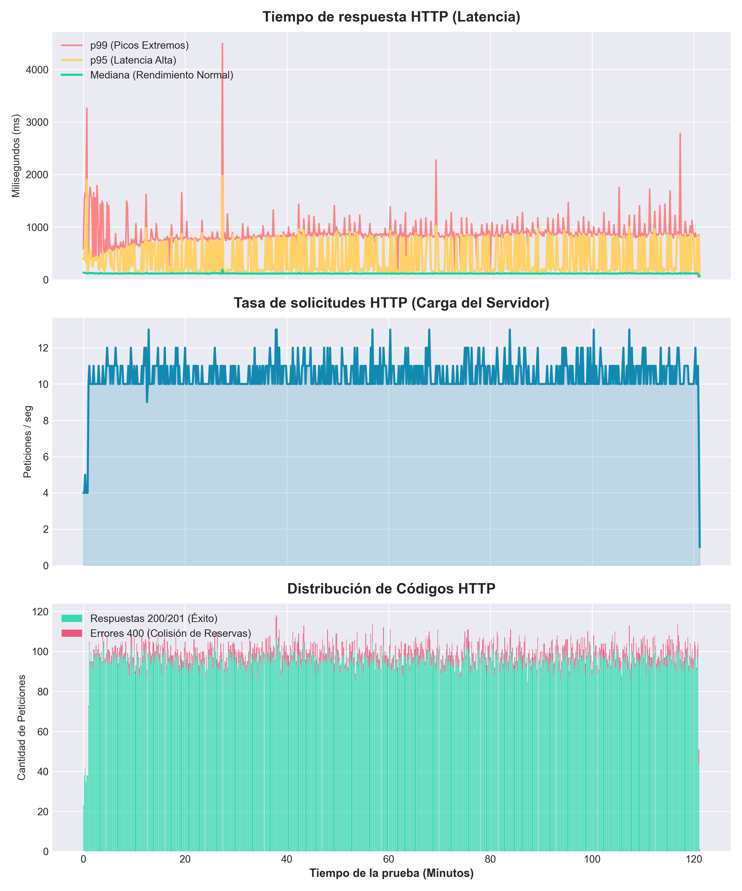

## Documentación de pruebas de carga y concurrencia

El objetivo de estas pruebas es validar el rendimiento de la aplicación bajo estrés, evaluar la correcta distribución del tráfico mediante el balanceador de carga (HAProxy) y confirmar que las políticas de concurrencia de reservas operan correctamente sin permitir solapamientos.

### Entorno de pruebas (hardware y software)

Las pruebas que se han ejecutado en un entorno local en una máquina con las siguientes especificaciones:

#### Especificaciones de hardware (máquina local):

##### Fases 0 y 1

Estas pruebas se llevaron a cabo en mi ordenador local con estas especificaciones:

- Sistema Operativo: [ Windows 10 Home (Versión 22H2, arquitectura de 64 bits) ]

- Procesador (CPU): [Intel(R) Core(TM) i7-1065G7 CPU @ 1.30GHz - 1.50 GHz. Cuenta con 4 núcleos físicos y 8 procesadores lógicos.]

- Memoria RAM: [ 8 GB ]

- Almacenamiento: [238 GB SSD ]

##### Fase 2   REVISAR ESTOOOOOO  SO? HAY MAS ESPECIFICACIONES IMPORTANTES?
En esta fase se desplegó la infraestructura en Amazon Web Services (AWS) mediante una plantilla de CloudFormation, utilizando recursos limitados correspondientes a la capa gratuita para establecer un entorno de pruebas controlado y de bajo coste:

- **Instancia EC2 (Servidor de Aplicaciones):** instancia `t3.micro` (2 vCPU, 1 GB de memoria RAM), ejecutando una única instancia contenerizada de la aplicación mediante Docker, sin réplicas ni políticas de auto-escalado activas.

- **Base de Datos RDS (Persistencia Relacional):** 1x instancia de base de datos `db.t3.micro` ejecutando MySQL 8.0 (2 vCPU, 1 GB de memoria RAM y 20GiB de Almacenamiento), configurada de forma aislada e independiente del servidor de aplicaciones.

- **Almacenamiento S3:** Un bucket de AWS S3 para la persistencia y distribución de imágenes asociadas a los espacios universitarios y fotos de perfil de los usuarios, sustituyendo el almacenamiento local basado en MinIO de las fases previas.

#### Especificaciones de software:

##### Fases 0 y 1

- Docker Desktop v4.29.0 configurado con el backend de WSL 2 (Windows Subsystem for Linux).
  Debido a esta configuración, los límites de recursos (CPU, memoria RAM, ...) no son estáticos, sino que son gestionados y asignados dinámicamente por el propio sistema operativo Windows según la demanda de los contenedores.

- 1 Balanceador de carga HAProxy (v2.8).

- 3 Réplicas de la aplicación.

- 1 Contenedor MySQL (v8.0).

- 1 Contenedor MinIO. (latest)

##### Fase 2

- 1 única instancia docker con la aplicación contenedorizada (EC2).

- 1 única instancia de base de datos (RDS).

- 1 única instancia de almacenamiento de ficheros (Bucket S3).

### Instrucciones de Ejecución

Para ejecutar las pruebas de carga, se han seguido los pasos descritos al final del archivo [**executionInstructions.md**](docs/executionInstructions.md)

### Herramienta y Escenario de Prueba

Se ha utilizado Artillery en local conectado a Artillery Cloud para la captura y visualización de telemetría.
El escenario simulado por cada Usuario Virtual (UV) replica el comportamiento real dentro de la aplicación de un usuario registrado
ya que se espera sean de estos la gran mayoria de la demanda de la aplicacióón. El flujo de acciones de los UV es el siguiente:

Petición POST a /api/auth/login para autenticación.

Petición GET a /api/auth/me para obtener datos de sesión.

Petición GET a /api/rooms para listar espacios disponibles.

Petición POST a /api/reservations para reservar una sala, se han programado varias peticiones compitiendo por la misma sala (roomId: 1) y en la misma franja horaria para comprobar la respuesta concurrente de la aplicación ante el estrés.

Petición POST a /api/auth/logout para cerrar la sesión.

### Fase 0(load-test-phase-0): Prueba de concurrencia local (sin balanceador de carga)

Esta prueba establece una línea base atacando directamente a una única instancia del backend desplegada en local (http://127.0.0.1:8080/).

- Configuración de carga: 10 usuarios/segundo durante 5 segundos (Total: 50 Usuarios).

- Resultados Esperados: El sistema debe gestionar el bloqueo a nivel de base de datos. De las 50 peticiones concurrentes para reservar la misma sala, se espera obtener exactamente un código HTTP 201 (reserva exitosa) y 49 códigos HTTP 400 (rechazo por concurrencia), demostrando que el bloqueo de la base de datos funciona como se espera.

- Resultados de ejecución:
  - Completados: 50 UVs (100% de éxito en ejecución).
  - Tiempos de respuesta: Mediana (p50) de 109ms y un p95 de 433ms.

  - Validación de Concurrencia: De las 50 peticiones concurrentes para reservar la misma sala, se obtuvo exactamente un código HTTP 201 y 49 códigos HTTP 400, demostrando que el bloqueo de la base de datos funciona como se espera.

  - Captura de pantalla de Artillery Cloud de este test:

    
    [Enlace al reporte completo en Artillery Cloud](https://app.artillery.io/opmgtbvasi7hy/load-tests/ttrq9_5atq3hydrf5cr77xktqf8p85wxaqf_ybtm)

- Conclusiones de la prueba: La aplicación maneja correctamente la concurrencia a nivel de base de datos, permitiendo solo una reserva exitosa y rechazando las demás. Sin embargo, el tiempo de respuesta p95 de 433ms indica que bajo esta carga, la aplicación puede experimentar cierta latencia, lo que sugiere que la arquitectura monolítica sin balanceo de carga puede no ser óptima para manejar cargas más altas.

### Fase 1A(load-test-phase-1): Prueba de carga y concurrencia local sostenida en arquitectura distribuida (con balanceador de carga)

Esta prueba evalúa la aplicación contenerizada completa (el docker-compose-dev.yml para desarrollo), atacando al balanceador de carga HAProxy (https://localhost/api) que funciona con un Round Robin gestionando las 3 replicas de la aplicación.

- Configuración de carga:
  - Fase de calentamiento (Warm up): 15 segundos a 2 UVs/seg.

  - Fase de carga sostenida: 30 segundos a 3 UVs/seg(se tuvo que bajar de 5UV/seg a 3UV/seg debido a que si no la CPU no daba a basto a tantas peticiones y algunas fallarian por ETIMEDOUT, y aun a pesar de este ajuste solo los test iniciales que se realizan estan libres de ETIMEDOUT por lo que esta es la cifra limite de aforo para la aplicación en local).

  - Total generado: 120 Usuarios.

- Algoritmo de Balanceo: Dynamic Round Robin.

- Resultados Esperados: El sistema debe distribuir la carga entre las 3 réplicas del backend, manteniendo tiempos de respuesta razonables. De las 120 peticiones concurrentes para reservar la misma sala, se espera obtener exactamente un código HTTP 201 (reserva exitosa) y 119 códigos HTTP 400 (rechazo por concurrencia), demostrando que el bloqueo de la base de datos sigue funcionando correctamente incluso bajo una carga más alta y distribuida.

- Resultados de ejecución:
  - Completados: 118 UVs completados con éxito. Hubo 2 fallos menores por ETIMEDOUT (1.67%), algo esperado al saturar la red interna de Docker en localhost y no disponer de más recursos para estos 2 usuarios mostrando que el umbral tolerable para mi aplicación esta en 3 usuarios por segundo ya que pruebas más alla de eso generan muchos más usuarios con errores ETIMEDOUT y con 3 usuarios por segundo el primer test que se corre de artillery es capaz de pasar completamente limpio y al segundo ya comienzan a aparecer errores de ETIMEDOUT.
  - Tiempos de respuesta: Mediana (p50) de 34ms y un p95 de 105ms.

  - Captura de pantalla de Artillery Cloud de este test:

    
    [Enlace al reporte completo en Artillery Cloud](https://app.artillery.io/opmgtbvasi7hy/load-tests/tdqza_e6dxacbw3rc3bka5p7bjckrdg5dy7_3emn)

  - Captura de pantalla de Artillery Cloud de este test con mas usuarios por segundo para mostrar la diferencia y el aforo limite de la aplicación en local para este test:

    
    [Enlace al reporte completo en Artillery Cloud](https://app.artillery.io/opmgtbvasi7hy/load-tests/tyttk_hcf64ykt5a67dhz9y7r56xk89c8cw_9j6b)

- Conclusiones de la prueba: A pesar de inyectar más del doble de usuarios virtuales que en la Fase 0, la arquitectura distribuida redujo el tiempo de respuesta p95 de 433ms a 162ms. Nuevamente, la regla de concurrencia se mantuvo sólida: 1 única reserva exitosa (HTTP 201) y 117 rechazos controlados (HTTP 400).

### Fase 1B(load-test-phase-1-heavy): Prueba de carga de procesamiento intensivo en entorno local

Tras validar la concurrencia y el limite de usuarios por segundo en local en mi máquina en la prueba anterior(1A), esta prueba busca estresar la CPU y la base de datos mediante endpoints que requieren cálculos complejos, búsquedas avanzadas y agregaciones de datos.
Con el fin de evaluar el rendimiento de la arquitectura ante lógica de negocio costosa aprovechando propiedades de la aplicación como:

- Hibernate Search: Búsquedas difusas (fuzzy search) y full-text.

- Cálculos geográficos: Uso de la fórmula de Haversine para distancias entre campus.

- Generación de mapas de calor: Procesamiento iterativo de calendarios y disponibilidad.

- Estadísticas dinámicas: Agregaciones en tiempo real de la ocupación.

- Configuración de carga:
  - Fase de calentamiento: 15 segundos a 2 UV/seg.

  - Fase de carga sostenida: 30 segundos a 2 UV/seg(se tuvo que bajar de 3UV/seg a 2UV/seg debido a que si no la CPU no daba a basto a tantas peticiones).

  - Total generado: 90 Usuarios (flujo completo de 6 peticiones pesadas por usuario).

- Algoritmo de Balanceo: Dynamic Round Robin.

- Resultados Esperados: El sistema debe gestionar la carga de procesamiento intensivo sin degradar significativamente los tiempos de respuesta. Se espera que el sistema mantenga,aunque sean superiores, unos tiempos de respuesta razonables no muy distantes a los obtenidos en la prueba 1A, demostrando que la arquitectura puede manejar operaciones complejas incluso bajo carga.

- Resultados de ejecución:
  - Completados: 90 UVs (100% de éxito).

  - Tiempos de respuesta: Mediana (p50) de 34ms y un p95 de 116ms. A pesar de la complejidad de los cálculos (Smart Search y Calendar), la distribución en 3 réplicas permite mantener latencias por debajo de los 100ms para el 95% de los usuarios.

  - Captura de pantalla de Artillery Cloud de este test:

    
    [Enlace al reporte completo en Artillery Cloud](https://app.artillery.io/opmgtbvasi7hy/load-tests/txe97_jxk3jxxjr8ht4q6cnf43xggqewz7p_t448)

Conclusiones de la prueba: La aplicación demuestra una alta capacidad de cómputo en local manteniendo unos tiempos de respuesta razonables para los procesos que se le piden, a pesar de las limitaciones del hardware sobre el que se ejecutan las pruebas, ante consultas bastante estresantes debido a la cantidad de computo que llevan.

### Fase 2A(load-test-phase-2-stress): Prueba de Esfuerzo y Límite en entorno AWS con una replica

El objetivo de esta prueba fue estresar la capacidad de procesamiento de la infraestructura en la nube bajo un escenario que simula el comportamiento de picos grandes de usuarios. Se buscó forzar los endpoints críticos del backend mediante tres perfiles de usuarios simulados:

- **Perfil de Consulta Pura (70% de la carga):** Usuarios que acceden a la plataforma de forma exclusiva para listar y filtrar espacios universitarios (`/api/search/rooms`), simulando un comportamiento pasivo de obtención de datos.
- **Perfil de Reserva Directa (20% de la carga):** Usuarios activos que efectúan consultas y proceden a intentar registrar de forma inmediata una reserva fija (`/api/reservations`).
- **Perfil de Búsqueda Inteligente (10% de la carga):** Usuarios que, al encontrar el espacio inicial ocupado, invocan de manera intensiva el algoritmo avanzado de sugerencias alternativas y disponibilidad temporal (`/api/reservations/smart-search`).

#### Configuración de la carga:
La prueba se estructuró en cuatro fases progresivas de inyección en Artillery: una fase de calentamiento a 2 UV/seg durante 60 segundos, seguida de una rampa agresiva incrementando hasta 10 UV/seg durante 120 segundos, aproximándose al límite teórico entre 10 y 12 UV/seg en los siguientes 120 segundos, y finalizando con un pico sostenido de 12 UV/seg durante 120 segundos adicionales.

#### Resultados de ejecución:
- **Completados con éxito lógico:** 100% de los usuarios virtuales completaron sus flujos de navegación sin provocar caídas del servicio de aplicaciones o interrupciones críticas del contenedor (cero errores HTTP 500).
- **Rendimiento por Endpoint y Códigos HTTP:**
  - `/api/auth/login` y `/api/search/rooms`: 100% de respuestas exitosas (HTTP 200). La infraestructura absorbió eficientemente las búsquedas de texto plano indexadas con Apache Lucene / Hibernate Search.
  - `/api/reservations`: Se registraron un volumen masivo de respuestas con código **HTTP 400 Bad Request** (~83.74% de las peticiones de este endpoint específico) frente a una fracción reducida de confirmaciones exitosas con código **HTTP 201 Created**.
  - **Tiempos de respuesta (Latencia):** Mientras que las lecturas mantuvieron una mediana (p50) baja y estable en torno a los 105ms, los intentos de escrituras concurrentes provocaron picos de degradación en los percentiles más altos, alcanzando un p95 de 686ms y un p99 de 1.4 segundos.

#### Captura de pantalla de Artillery Cloud de este test:

[Enlace al reporte completo en Artillery Cloud](https://app.artillery.io/opmgtbvasi7hy/load-tests/tbbh3_6zhnak567qt66awzqrwhhygg4r74b_ktca)

#### Conclusiones de la prueba de esfuerzo:
El comportamiento arrojado por el test de esfuerzo es completamente correcto y esperado desde la perspectiva de la lógica de negocio de la aplicación. La presencia generalizada de códigos HTTP 400 no responde a un fallo de la aplicación bloqueando reservas validas, sino a la protección activa del modelo de datos frente al *overbooking*. 

Debido a que el sistema utiliza un mecanismo de bloqueo pesimista en la capa de persistencia (`@Lock(LockModeType.PESSIMISTIC_WRITE)` en las operaciones de solapamiento del `ReservationRepository`(las reservas)), cuando cientos de hilos concurrentes intentan registrar reservas superpuestas sobre las mismas aulas y en la misma franja de horas, la base de datos encola las transacciones y procesa secuencialmente la primera solicitud válida (HTTP 201). El resto de hilos en espera detectan la colisión de disponibilidad temporal inmediatamente después de liberarse el cerrojo de fila y rechazan la petición de forma segura mediante excepciones controladas de lógica de negocio (HTTP 400). 

La degradación en el percentil p99 se debe precisamente a este tiempo de retención que sufren los hilos de Tomcat en el pool de HikariCP mientras esperan a que se liberen los bloqueos exclusivos de las tuplas en MySQL, un compromiso ineludible si se desea garantizar la consistencia ACID de las reservas sin añadir réplicas de bases de datos con sincronización distribuida.

---

### Fase 2B (load-test-phase-2-soak): Prueba de Resistencia y Estabilidad Sostenida (Soak Test) en entorno AWS

El propósito de esta fase fue someter a la instancia única de AWS a una carga continua de usuarios virtuales (`arrivalRate: 5` usuarios por segundo) con el fin de evaluar la fatiga del sistema a lo largo del tiempo, vigilando el comportamiento del recolector de basura de la JVM (*Garbage Collector*), el uso sostenido del pool de conexiones de base de datos HikariCP y la posible presencia de fugas de memoria (*Memory Leaks*).

#### Limitación del plan gratuito de la herramienta Artillery Cloud:
Debido a las políticas comerciales implementadas en la plataforma de Artillery, la visualización y captura de telemetría a través de su servicio en la nube (*Artillery Cloud*) se encuentra restringida a un máximo estricto de 30 minutos de duración en su plan gratuito. Dado que una prueba de resistencia requiere analizar el comportamiento persistente del sistema operativo y de los contenedores más allá de dicho umbral temporal, se optó por una estrategia diferente. 

Se configuró Artillery para volcar todas las métricas e intervalos de telemetría del test en formato `.json`. Posteriormente, se diseñó e implementó un script automatizado en Python que procesa dicho JSON de forma local. Este script extrae de forma secuencial las métricas agregadas por periodos e implementa un generador de gráficos (gráficas de latencia percentilada, tasa de transferencia y volumen de códigos HTTP), garantizando graficas con el sufiente detalle como para suplir las de *Artillery Cloud*.

#### Resultados de ejecución y telemetría:
- **Volumen Total:** Se procesó un flujo histórico masivo que superó los 36,120 usuarios virtuales creados, traduciéndose en un total acumulado de 72,502 peticiones HTTP procesadas por el servidor.
- **Códigos de Estado y Errores de Flujo:**
  - Respuestas exitosas de sesión y lectura (HTTP 200): 68,783 peticiones.
  - Reservas confirmadas (HTTP 201): 108 peticiones.
  - Rechazos por reglas de negocio (HTTP 400): 3,611 peticiones.
  - Usuarios abortados por Artillery (`vusers.failed`): 7,176 usuarios virtuales. 
- **Estudio de Tiempos de Respuesta Sostenidos:** La mediana global (p50) demostró un comportamiento robusto, manteniéndose plana a lo largo de toda la línea de tiempo del test en un rango de entre 85ms y 115ms. Las latencias máximas registradas mostraron picos controlados que se estabilizaron en torno a los 1.5 y 1.8 segundos en los intervalos de máxima concurrencia de transacciones de escritura de reservas.

#### Captura de las gráficas de telemetría procesadas localmente mediante el script en Python:

#### Conclusiones de la prueba de resistencia (Soak Test):
El test de resistencia mostro 2 grandes conclusiones de la infraestructura actual de la aplicación:

1. **Ausencia de Fugas de Memoria (Memory Leaks):** La estabilidad absoluta de la mediana de tiempo de respuesta (p50) y la consistencia en el volumen de peticiones procesadas demuestran que el recolector de basura de Java es capaz de liberar eficientemente la memoria de los objetos de sesión descatalogados. Si existiera una fuga de memoria en el montón de la JVM o una retención indebida de conexiones en HikariCP, los tiempos de respuesta habrían mostrado una pendiente ascendente progresiva debido al *thrashing* de memoria o al agotamiento definitivo de los hilos de Tomcat, comportamiento que queda descartado al analizar las líneas planas de rendimiento.

2. **Causa raíz de los usuarios abortados por la herramienta:** El volumen de usuarios marcados como fallidos por Artillery (`vusers.failed: 7176`) es debio al escenario simulado en el archivo de configuración de Artillery. Al inyectar una carga fija de usuarios que competían secuencialmente por un número restringido de salas en idénticas horas, la inmensa mayoría de las solicitudes de reserva de la Fase 2 del flujo terminaban devolviendo un código 400 legítimo (sala no disponible). 

### Propuestas de optimización y líneas de mejora futuras de esta Fase 2

A partir de los cuellos de botella identificados en los entornos de esfuerzo y resistencia alojados en la nube, se proponen las siguientes optimizaciones de arquitectura de software para futuras versiones del sistema sin alterar la seguridad de los datos:

- **Dispersión Estocástica en Pruebas de Carga:** Para evaluar el rendimiento de la base de datos libre de bloqueos de lógica empresarial, se debe modificar el procesador JavaScript del generador de carga (`processor-multi-room.js`). Reemplazar las franjas horarias estáticas (como el bloque fijo de 10:00 a 12:00) por una asignación dinámica y aleatoria que distribuya las solicitudes a lo largo de toda la jornada universitaria operativa (de 08:00 a 21:00) y amplíe el rango de días. Esto aumentará el espacio de probabilidad transaccional a más de un millón de combinaciones, reduciendo las colisiones lógicas y permitiendo medir de forma pura la latencia de inserción en disco de la instancia RDS.

- **Migración a Bloqueo Optimista (Optimistic Locking):** Para mitigar los picos de latencia en el percentil p99 provocados por la retención de hilos de base de datos bajo alta concurrencia, se propone sustituir los cerrojos pesimistas por un enfoque optimista basado en anotaciones `@Version` en la entidad `Reservation` de Hibernate. De este modo, en lugar de bloquear la base de datos de manera exclusiva mientras se procesa la disponibilidad, el sistema procesará las transacciones en paralelo y rechazará de forma instantánea en el commit las operaciones concurrentes que colisionen, reduciendo el tiempo de espera de los hilos de Tomcat de segundos a escasos milisegundos.

- **Ajuste de Timeouts del Pool de Conexiones:** En el archivo `application.properties`, se debe añadir la directiva `spring.datasource.hikari.connection-timeout=5000`. Limitar el tiempo de espera de obtención de conexiones de Hikari a 5 segundos obligará al servidor a liberar hilos rápidamente bajo escenarios de estrés masivo, evitando la acumulación destructiva de solicitudes en cola en el servidor web.

