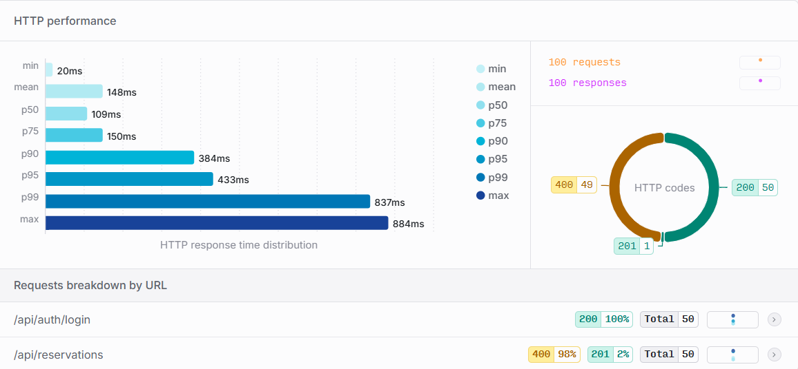
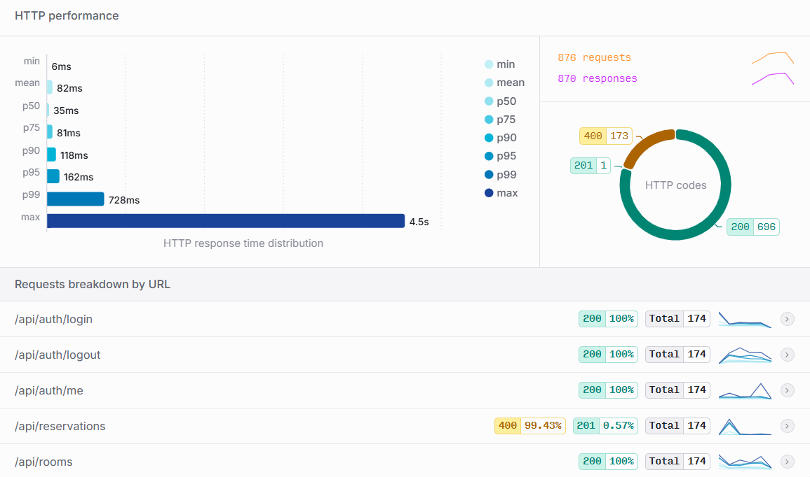

## Documentación de pruebas de carga y concurrencia

El objetivo de estas pruebas es validar el rendimiento de la aplicación bajo estrés, evaluar la correcta distribución del tráfico mediante el balanceador de carga (HAProxy) y confirmar que las políticas de concurrencia de reservas operan correctamente sin permitir solapamientos.

### Entorno de pruebas (hardware y software)

Las pruebas que se han ejecutado en un entorno local en una máquina con las siguientes especificaciones:

#### Especificaciones de hardware:

- Sistema Operativo: [ Windows 10 Home (Versión 22H2, arquitectura de 64 bits) ]

- Procesador (CPU): [Intel(R) Core(TM) i7-1065G7 CPU @ 1.30GHz - 1.50 GHz. Cuenta con 4 núcleos físicos y 8 procesadores lógicos.]

- Memoria RAM: [ 8 GB ]

- Almacenamiento: [238 GB SSD ]

#### Especificaciones de software (infraestructura Docker):

- Docker Desktop v4.29.0 configurado con el backend de WSL 2 (Windows Subsystem for Linux).
  Debido a esta configuración, los límites de recursos (CPU, memoria RAM, ...) no son estáticos, sino que son gestionados y asignados dinámicamente por el propio sistema operativo Windows según la demanda de los contenedores.

- 1 Balanceador de carga HAProxy (v2.8).

- 3 Réplicas de la aplicación.

- 1 Contenedor MySQL (v8.0).

- 1 Contenedor MinIO. (latest)

### Instrucciones de Ejecución

Para ejecutar las pruebas de carga, se han seguido los pasos descritos al final del archivo [**executionInstructions.md**](docs/executionInstructions.md)

### Herramienta y Escenario de Prueba

Se ha utilizado Artillery en local conectado a Artillery Cloud para la captura y visualización de telemetría.
El escenario simulado por cada Usuario Virtual (UV) replica el comportamiento real dentro de la aplicación de un usuario registrado
ya que se espera sean de estos la gran mayoria de la demanda de la aplicacióón. El flujo de acciones de los UV es el siguiente:

Petición POST a /api/auth/login para autenticación.

Petición GET a /api/auth/me para obtener datos de sesión.

Petición GET a /api/rooms para listar espacios disponibles.

Petición POST a /api/reservations para reservar una sala, se han programado varias peticiones compitiendo por la misma sala (roomId: 1) y en la misma franja horaria para comprobar la respuesta concurrente de la aplicación ante el estrés.

Petición POST a /api/auth/logout para cerrar la sesión.

### Fase 0(load-test-phase-0): Prueba de concurrencia local (sin balanceador de carga)

Esta prueba establece una línea base atacando directamente a una única instancia del backend desplegada en local (http://127.0.0.1:8080/).

- Configuración de carga: 10 usuarios/segundo durante 5 segundos (Total: 50 Usuarios).

- Resultados Esperados: El sistema debe gestionar el bloqueo a nivel de base de datos. De las 50 peticiones concurrentes para reservar la misma sala, se espera obtener exactamente un código HTTP 201 (reserva exitosa) y 49 códigos HTTP 400 (rechazo por concurrencia), demostrando que el bloqueo de la base de datos funciona como se espera.

- Resultados de ejecución:
  - Completados: 50 UVs (100% de éxito en ejecución).
  - Tiempos de respuesta: Mediana (p50) de 109ms y un p95 de 433ms.

  - Validación de Concurrencia: De las 50 peticiones concurrentes para reservar la misma sala, se obtuvo exactamente un código HTTP 201 y 49 códigos HTTP 400, demostrando que el bloqueo de la base de datos funciona como se espera.

  - Captura de pantalla de Artillery Cloud de este test:

    
    [Enlace al reporte completo en Artillery Cloud](https://app.artillery.io/opmgtbvasi7hy/load-tests/ttrq9_5atq3hydrf5cr77xktqf8p85wxaqf_ybtm)

- Conclusiones de la prueba: La aplicación maneja correctamente la concurrencia a nivel de base de datos, permitiendo solo una reserva exitosa y rechazando las demás. Sin embargo, el tiempo de respuesta p95 de 433ms indica que bajo esta carga, la aplicación puede experimentar cierta latencia, lo que sugiere que la arquitectura monolítica sin balanceo de carga puede no ser óptima para manejar cargas más altas.

### Fase 1(load-test-phase-1): Prueba de carga y concurrencia local sostenida en arquitectura distribuida (con balanceador de carga)

Esta prueba evalúa la aplicación contenerizada completa (el docker-compose-dev.yml para desarrollo), atacando al balanceador de carga HAProxy (https://localhost/api) que funciona con un Round Robin gestionando las 3 replicas de la aplicación.

- Configuración de carga:
  - Fase de calentamiento (Warm up): 15 segundos a 2 UVs/seg.

  - Fase de carga sostenida: 30 segundos a 5 UVs/seg.

  - Total generado: 180 Usuarios.

- Algoritmo de Balanceo: Dynamic Round Robin.

- Resultados Esperados: El sistema debe distribuir la carga entre las 3 réplicas del backend, manteniendo tiempos de respuesta razonables. De las 180 peticiones concurrentes para reservar la misma sala, se espera obtener exactamente un código HTTP 201 (reserva exitosa) y 179 códigos HTTP 400 (rechazo por concurrencia), demostrando que el bloqueo de la base de datos sigue funcionando correctamente incluso bajo una carga más alta y distribuida.

- Resultados de ejecución:
  - Completados: 174 UVs completados con éxito. Hubo 6 fallos menores por ETIMEDOUT (3.3%), algo esperado al saturar la red interna de Docker en localhost y no disponer de más recursos para estos 6 usuarios.
  - Tiempos de respuesta: Mediana (p50) de 35ms y un p95 de 162ms.

  - Captura de pantalla de Artillery Cloud de este test:

    
    [Enlace al reporte completo en Artillery Cloud](https://app.artillery.io/opmgtbvasi7hy/load-tests/tyttk_hcf64ykt5a67dhz9y7r56xk89c8cw_9j6b)

- Conclusiones de la prueba: A pesar de inyectar más del triple de usuarios virtuales que en la Fase 0, la arquitectura distribuida redujo el tiempo de respuesta p95 de 433ms a 162ms. Nuevamente, la regla de concurrencia se mantuvo sólida: 1 única reserva exitosa (HTTP 201) y 173 rechazos controlados (HTTP 400).
