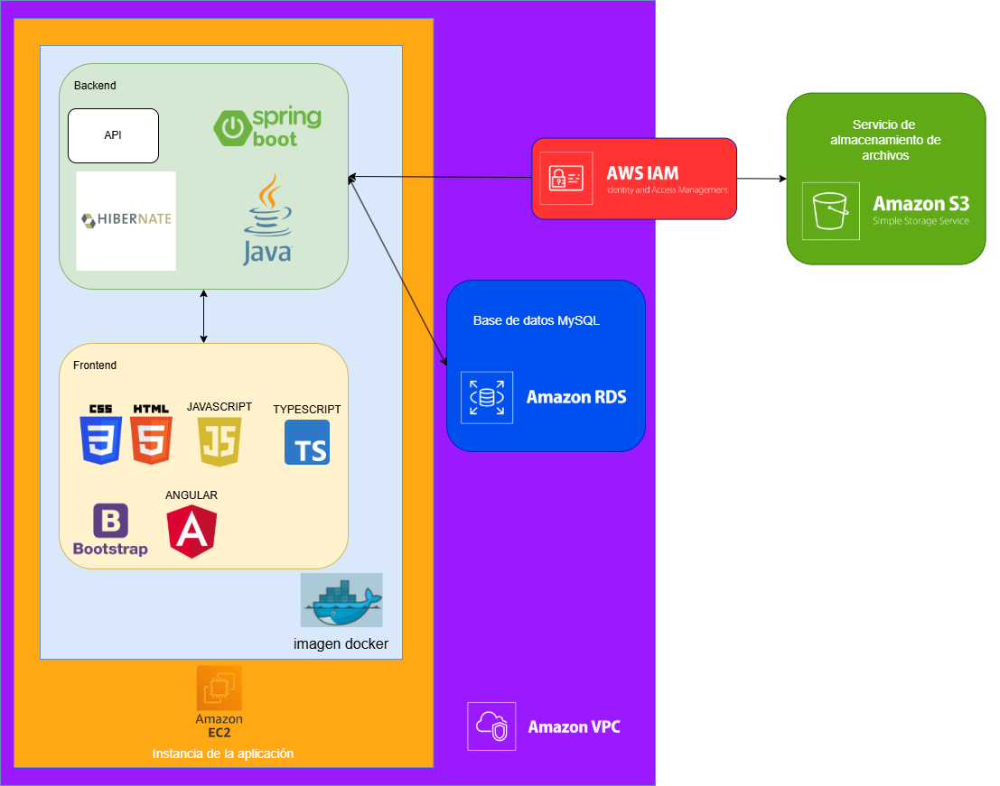

## 🏗️ Arquitectura de Despliegue

A continuación se muestra como la arquitectura ha ido evolucionando a lo largo de las fase de este proyecto una vez en el anterior ya fue una aplicación completamente operativa:

### Fase 0
En esta fase la arquitectura es identica a la arquitectura con la que se termino el anterior Trabajo Fin de Grado (TFG). El sistema se orquesta localmente mediante docker-compose y se compone de tres contenedores principales comunicados a través de una red interna aislada:

- **🗄️ Base de Datos (MySQL):** Ejecuta la imagen oficial de MySQL. Por seguridad, el puerto interno (3306) no se expone a la máquina anfitriona, permitiendo acceso únicamente desde la red de Docker. Utiliza volúmenes persistentes para evitar la pérdida de datos.

- **⚙️ Servidor Backend (Spring Boot):** Ejecuta la API REST y procesa toda la lógica de negocio. No expone puertos al exterior y es el único autorizado para conectarse con la base de datos.

- **💻 Cliente Frontend (Angular):** Sirve los archivos estáticos generados por Angular. Se conecta con el backend mediante la API REST de este.

### Fase 1 
La arquitectura del proyecto se basa en la contenedorización integral de los servicios, garantizando una ejecución idéntica en cualquier entorno. El sistema se orquesta localmente mediante `docker-compose` y se compone de cuatro contenedores principales (más las réplicas) comunicados a través de una red interna aislada:

- **🗄️ Base de Datos (MySQL):** Ejecuta la imagen oficial de MySQL. Por seguridad, el puerto interno (3306) no se expone a la máquina anfitriona, permitiendo acceso únicamente desde la red de Docker. Utiliza volúmenes persistentes para evitar la pérdida de datos.

- **⚖️ Balanceador de carga (HAProxy):** Actúa como único punto de entrada a la aplicación (exponiendo el puerto seguro 443 al exterior). Se encarga de gestionar los certificados SSL y distribuir equitativamente las solicitudes entre las distintas réplicas de la aplicación.

- **💾 Servicio de almacenamiento de archivos (MinIO):** Proporciona almacenamiento de objetos compatible con S3 para la gestión de archivos e imágenes. Sus puertos internos (9000 y 9001) no se exponen al exterior, aislando el acceso a la red de Docker. Adicionalmente, se ejecuta un contenedor efímero (minio-setup) que configura automáticamente los buckets y permisos iniciales.

- **Contenedor de la Aplicación (Study-Space):** Se despliega como un clúster escalable (actualmente con 3 réplicas). Gracias a un Dockerfile multi-etapa, este contenedor unifica el Frontend y el Backend en un solo artefacto ejecutable:
  - **⚙️ Servidor Backend (Spring Boot):** Procesa toda la lógica de negocio, se conecta con MySQL y MinIO, y expone internamente el puerto 8080 para que HAProxy le envíe tráfico.

  - **💻 Cliente Frontend (Angular):** Sirve los archivos estáticos generados por Angular. Se conecta con el backend mediante la API REST de este.

### Fase 2 
La arquitectura de esta fase del proyecto se basa en la migración de la anterior arquitectura al entorno Amazon Web Services (AWS). Esta arquitectura volvera a disponer de una sola replica a diferencia de las 3 replicas de la fase anterior:

- **🗄️ Amazon Relational Database Service (RDS):** Ejecuta la base de datos MySQL de la aplicación. Se comunica mediante la Virtual Private Cloud (VPC) de Amazon unicamente con la instancia Amazon Elastic Compute Cloud (EC2). Gracias a los Amazon Security Goups esta base de datos solo acepta trafico proveniente del puerto 3306 desde la EC2, sin exponer ningun puerto más.

- **💾 Amazon Simple Storage Service (S3):** Proporciona almacenamiento de objetos para la gestión de archivos e imágenes. Este servicio se encuentra fuera de la VPC por lo que tenemos que usar Amazon Identity and Access Management (IAM) para lograr comunicar la instancia EC2 con el servicio S3 mediante roles de identidad.

- **Amazon Elastic Compute Cloud (EC2):** Despliega una instancia en base a la imagen docker que se le mencione en la plantilla que se suba a CloudFormation. Esta imagen docker proviene del repositorio de Docker Hub donde se encuentran las diferentes imagenes de la aplicación (dichos links a dichas imagenes se encuentran en la sección [**app_images.md**](app_images.md) de esta misma documentacion). Esta instancia EC2 solo expone los puertos 80(frontend) y 8080 (API REST Backend) hacia internet fuera de la VPC de Amazon. Esta imagen unifica el Frontend y el Backend en un solo artefacto ejecutable:
  - **⚙️ Servidor Backend (Spring Boot):** Procesa toda la lógica de negocio, se conecta con RDS y S3.

  - **💻 Cliente Frontend (Angular):** Sirve los archivos estáticos generados por Angular. Se conecta con el backend mediante la API REST de este.

### Fase 3

#######Falkta por hacer################################
La arquitectura del proyecto se basa en la contenedorización integral de los servicios, garantizando una ejecución idéntica en cualquier entorno. El sistema se orquesta localmente mediante `docker-compose` y se compone de cuatro contenedores principales (más las réplicas) comunicados a través de una red interna aislada:

- **🗄️ Base de Datos (MySQL):** Ejecuta la imagen oficial de MySQL. Por seguridad, el puerto interno (3306) no se expone a la máquina anfitriona, permitiendo acceso únicamente desde la red de Docker. Utiliza volúmenes persistentes para evitar la pérdida de datos.

- **⚖️ Balanceador de carga (HAProxy):** Actúa como único punto de entrada a la aplicación (exponiendo el puerto seguro 443 al exterior). Se encarga de gestionar los certificados SSL y distribuir equitativamente las solicitudes entre las distintas réplicas de la aplicación.

- **💾 Servicio de almacenamiento de archivos (MinIO):** Proporciona almacenamiento de objetos compatible con S3 para la gestión de archivos e imágenes. Sus puertos internos (9000 y 9001) no se exponen al exterior, aislando el acceso a la red de Docker. Adicionalmente, se ejecuta un contenedor efímero (minio-setup) que configura automáticamente los buckets y permisos iniciales.

- **Contenedor de la Aplicación (Study-Space):** Se despliega como un clúster escalable (actualmente con 3 réplicas). Gracias a un Dockerfile multi-etapa, este contenedor unifica el Frontend y el Backend en un solo artefacto ejecutable:
  - **⚙️ Servidor Backend (Spring Boot):** Procesa toda la lógica de negocio, se conecta con MySQL y MinIO, y expone internamente el puerto 8080 para que HAProxy le envíe tráfico.

  - **💻 Cliente Frontend (Angular):** Sirve los archivos estáticos generados por Angular. Se conecta con el backend mediante la API REST de este.

