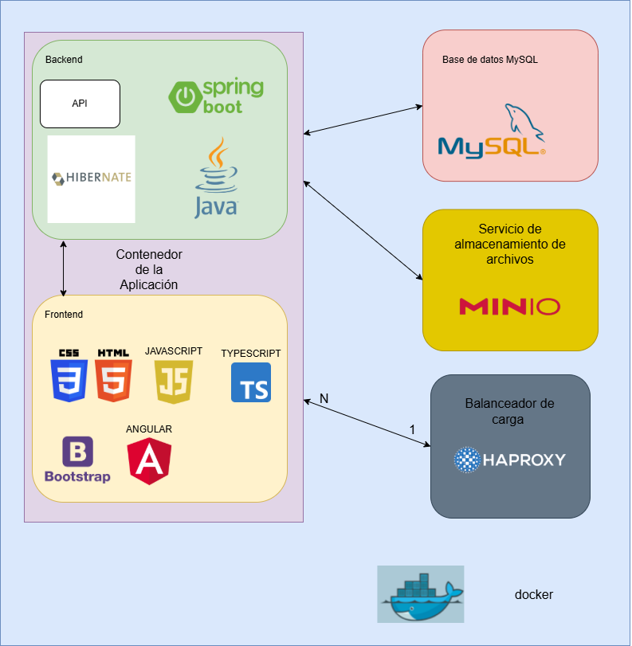

## 🏗️ Arquitectura de Despliegue

La arquitectura del proyecto se basa en la contenedorización integral de los servicios, garantizando una ejecución idéntica en cualquier entorno. El sistema se orquesta localmente mediante `docker-compose` y se compone de cuatro contenedores principales (más las réplicas) comunicados a través de una red interna aislada:

- **🗄️ Base de Datos (MySQL):** Ejecuta la imagen oficial de MySQL. Por seguridad, el puerto interno (3306) no se expone a la máquina anfitriona, permitiendo acceso únicamente desde la red de Docker. Utiliza volúmenes persistentes para evitar la pérdida de datos.

- **⚖️ Balanceador de carga (HAProxy):** Actúa como único punto de entrada a la aplicación (exponiendo el puerto seguro 443 al exterior). Se encarga de gestionar los certificados SSL y distribuir equitativamente las solicitudes entre las distintas réplicas de la aplicación.

- **💾 Servicio de almacenamiento de archivos (MinIO):** Proporciona almacenamiento de objetos compatible con S3 para la gestión de archivos e imágenes. Sus puertos internos (9000 y 9001) no se exponen al exterior, aislando el acceso a la red de Docker. Adicionalmente, se ejecuta un contenedor efímero (minio-setup) que configura automáticamente los buckets y permisos iniciales.

- **Contenedor de la Aplicación (Study-Space):** Se despliega como un clúster escalable (actualmente con 3 réplicas). Gracias a un Dockerfile multi-etapa, este contenedor unifica el Frontend y el Backend en un solo artefacto ejecutable:
  - **⚙️ Servidor Backend (Spring Boot):** Procesa toda la lógica de negocio, se conecta con MySQL y MinIO, y expone internamente el puerto 8080 para que HAProxy le envíe tráfico.

  - **💻 Cliente Frontend (Angular):** Sirve los archivos estáticos generados por Angular. Se conecta con el backend mediante la API REST de este.

