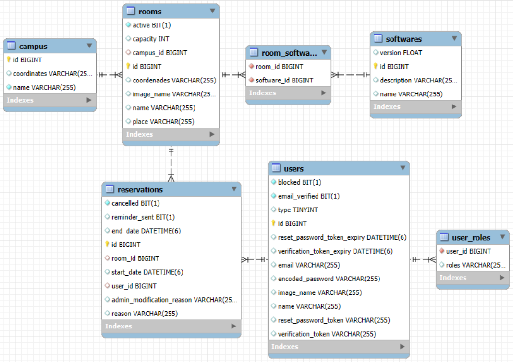

## 🗃️ Modelo del Dominio

Las entidades principales del sistema son:

- **User (Usuario):** Contiene atributos de identificación, credenciales y una colección de roles. Está indexado en Lucene y gestiona su estado de acceso (`blocked`) y recuperación de contraseñas (`resetPasswordToken`).
- **Room (Aula):** Recurso físico reservable. Almacena la información técnica del espacio (`capacity`, `camp`, `active`, ...). A nivel de indexación, permite filtrado exacto (`@GenericField`) sobre su capacidad y búsqueda difusa sobre su nombre.
- **Software:** Catálogo de programas. Mantiene una relación de muchos a muchos (N:M) bidireccional con la entidad _Room_. Se utiliza la anotación `@IndexedEmbedded` para que las búsquedas de aulas puedan filtrar directamente por los programas instalados en ellas.
- **Campus:** Entidad que representa un campus universitario. Mantiene una relación de uno a muchos (1:N) con _Room_ y permite búsquedas exactas sobre su nombre.
- **Reservation (Reserva):** Entidad transaccional que relaciona a un _User_ con una _Room_. Define el intervalo de ocupación e incorpora lógica de estado (cancelaciones, confirmaciones por token de verificación y auditoría de modificaciones de administrador).

