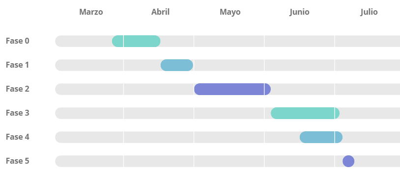

### 🛠️ Metodología

El desarrollo seguirá un enfoque iterativo y secuencial, con entregas periódicas y revisión por el tutor en cada fase.

Las fases del 1º TFG se planificaron de la siguiente manera:

- **Fase 1:** Definición de funcionalidades y pantallas (Finalización: 30 septiembre)

- **Fase 2:** Configuración repositorio, CI y Sonar (Finalización: 3 noviembre)

- **Fase 3:** Funcionalidad básica con pruebas: Unit, Int y E2E (Finalización: 21 enero)

- **Fase 4:** Versión 0.1 - Funcionalidad completa y Docker (Finalización: 4 marzo)

- **Fase 5:** Memoria (Finalización: 18 marzo)

- **Fase 6:** Defensa y finalización 1º TFG (Finalización: 25 marzo)

Las fases del 2º TFG se planificaron de la siguiente manera:

- **Fase 7:** Arreglar los apuntes mencionados en la defensa del primer TFG (Finalización: 16 de abril)

- **Fase 8:** Docker Compose con replicas en el backend (Finalización: 30 de abril)

- **Fase 9:** Despliegue en AWS simple (Finalización: 4 de junio)

- **Fase 10:** Despliegue en AWS avanzado (Finalización: 3 de julio)

- **Fase 11:** Memoria 2º TFG (Finalización: 4 de julio)

- **Fase 12:** Presentación y defensa 2º TFG (Finalización: 8 de julio)

Diagrama de Gantt 1º TFG:

Diagrama de Gantt 2º TFG:

